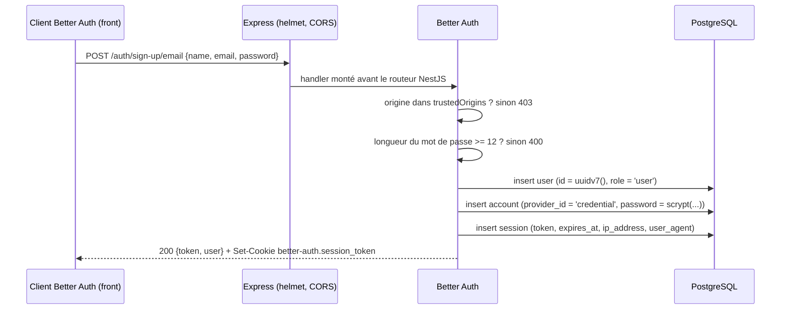
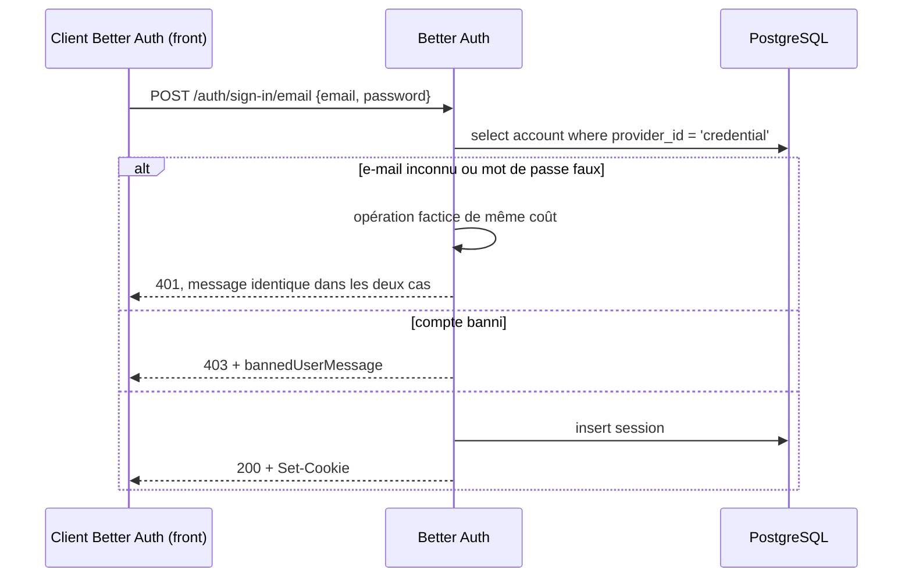
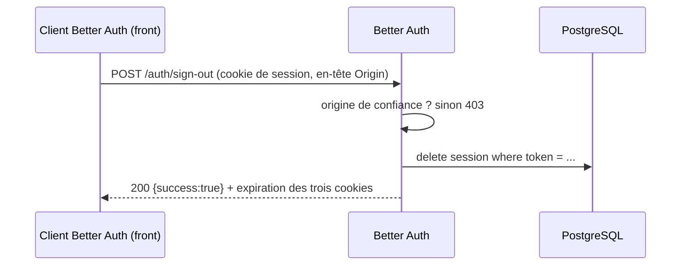
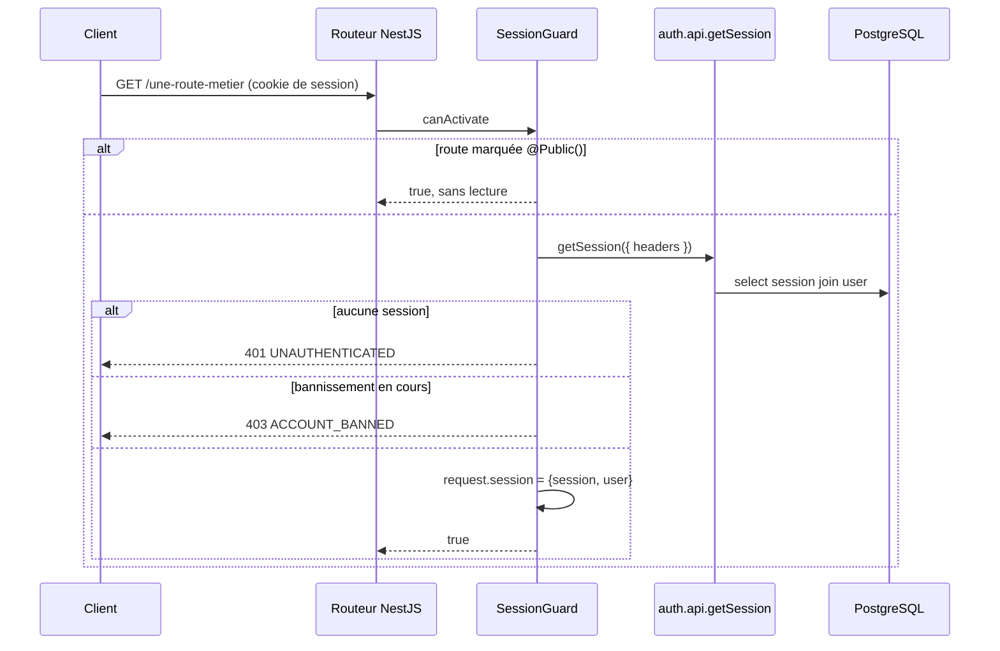
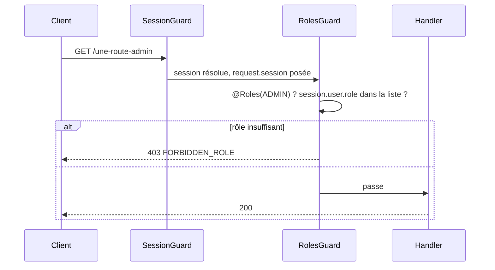
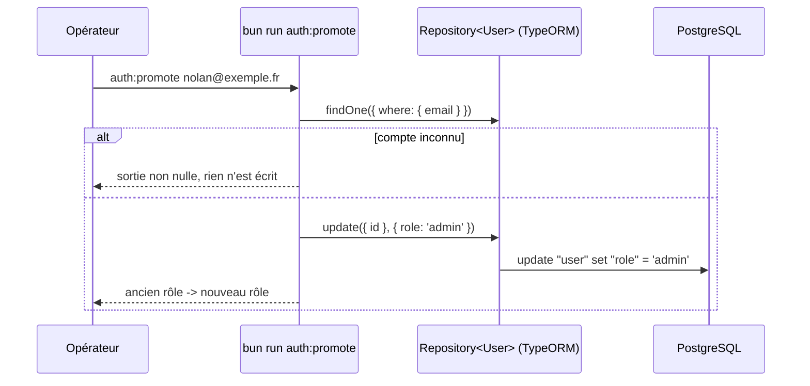
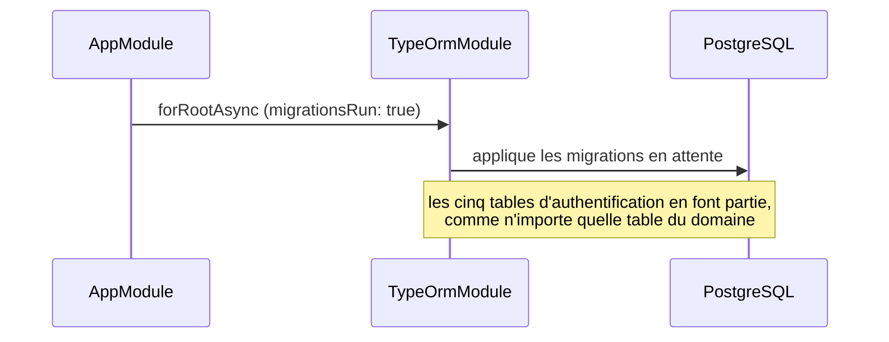

# Authentification — spécification d'implémentation

> **Source** : cahier des charges `JEB/DNI/2026-002` §3.1 (« authentification
> multi-rôles avec sessions »), documentation Better Auth 1.7.2.
> **Portée** : inscription, connexion, déconnexion, rôles `user` et `admin`,
> garde de session côté NestJS. Hors portée : partenaires, clés d'API SIRH,
> vérification d'e-mail, réinitialisation de mot de passe, fédération OAuth.
> **Vérifié contre** : `better-auth@1.7.2`, `@nestjs/common@12.0.1`,
> `express@5.2.1`, PostgreSQL 18, Bun 1.3.14.

## 1. Ce que ce lot livre

| Capacité                     | Servi par                                   |
| ---------------------------- | ------------------------------------------- |
| Créer un compte salarié      | `POST /auth/sign-up/email`                  |
| Se connecter                 | `POST /auth/sign-in/email`                  |
| Se déconnecter               | `POST /auth/sign-out`                       |
| Lire sa session              | `GET /auth/get-session`                     |
| Administrer les comptes      | `/auth/admin/*` (liste, rôle, bannissement) |
| Protéger une route métier    | `SessionGuard`, globale                     |
| Réserver une route à un rôle | `@Roles(ROLES.ADMIN)`                       |
| Promouvoir un compte         | `bun run auth:promote <email> [rôle]`       |
| Poser le schéma              | `bun run db:migrate`, appliqué au démarrage |

Les routes d'authentification sont servies par Better Auth et appelées
**directement par le frontend**, à travers son client (`better-auth/react`,
construit avec le même `basePath`). Cette API n'en réexpose aucune (§2, D11).

Un rôle `partner` s'ajoutera sans rien défaire : `user.role` porte une chaîne
libre et la garde compare des constantes.

## 2. Décisions verrouillées

| #   | Décision                                                                     | Raison                                                                                                                                        |
| --- | ---------------------------------------------------------------------------- | --------------------------------------------------------------------------------------------------------------------------------------------- |
| D1  | Better Auth porte la **logique** d'authentification, pas le schéma.          | Mots de passe, sessions, rôles et bannissement sont du code déjà écrit et déjà audité. Les tables, elles, sont du domaine de ce dépôt.        |
| D2  | Le schéma appartient à TypeORM : cinq entities, migration par `db:generate`. | §3. Une seule source de vérité, un seul migrateur, et une clé étrangère métier vers `user.id` devient une relation ordinaire.                 |
| D3  | Aucun second migrateur. Le schéma s'applique au démarrage comme les autres.  | Le dépôt promet déjà « récupérer une branche et lancer le serveur suffit à être sur son schéma ». Une promesse, un mécanisme.                 |
| D4  | Montage à `/auth`, pas à `/api/auth`.                                        | Cette API n'a pas de segment `/api` — `/health`, `/docs`. Le client web est construit avec le même `basePath`.                                |
| D5  | Pas de plugin `organization`.                                                | Il modélise des espaces à plusieurs membres avec invitations ; le sujet décrit un compte partenaire unique. Refusé le 2026-09-01.             |
| D6  | Pas de `cookieCache`.                                                        | §11 — un cache garde un compte banni et un rôle périmé vivants jusqu'à son expiration. Ce lot existe pour bannir et promouvoir.               |
| D7  | Clés primaires `uuid` avec défaut `uuidv7()`, comme toutes les tables.       | `generateId: false` laisse la base générer. Sans ça les identifiants d'auth seraient des chaînes base62 et les FK métier des colonnes `text`. |
| D8  | La bibliothèque `@thallesp/nestjs-better-auth` n'est pas utilisée.           | §7.1 — elle déclare `@nestjs/common@^11.1.6` en peer non optionnelle, ce dépôt est en NestJS 12.                                              |
| D9  | Longueur minimale de mot de passe : 12 caractères.                           | Recommandation ANSSI-PG-078 pour un compte sans second facteur. La valeur par défaut de la bibliothèque est 8.                                |
| D10 | Limitation de débit activée, stockée en base.                                | Les routes d'authentification sont la surface brute-forçable de ce lot. Le stockage mémoire perd son compteur à chaque redémarrage.           |
| D11 | **Aucun controller NestJS d'authentification.**                              | §5.2 — le client Better Auth du frontend appelle `/auth/*` directement. Un controller qui les réexpose est une seconde copie du contrat.      |
| D12 | Colonnes en `snake_case`, mapping **calculé**, jamais recopié.               | §4.2 — le mapping et la stratégie de nommage partagent une seule implémentation, donc ils ne peuvent pas diverger.                            |
| D13 | `NODE_ENV` est chargé **avant** le premier import de la bibliothèque.        | §7.4 — elle le lit une seule fois, au chargement de son module, et cette lecture décide de la limitation de débit et des cookies `Secure`.    |

## 3. Pourquoi le schéma est à nous

Better Auth sait poser ses tables lui-même : `getMigrations()` construit un plan
et l'exécute par Kysely. Ce chemin a été écarté.

| Critère                              | Migrateur Better Auth                                                                           | Entities TypeORM (retenu)           |
| ------------------------------------ | ----------------------------------------------------------------------------------------------- | ----------------------------------- |
| Nombre de migrateurs sur une base    | 2                                                                                               | 1                                   |
| `db:drop` puis remise en état        | deux commandes, dont une que le dépôt doit inventer                                             | `db:reset`, inchangé                |
| Nommage des colonnes                 | `"camelCase"` cité, contre `snake_case` partout ailleurs                                        | `snake_case`, `SnakeNamingStrategy` |
| Clé primaire                         | `text` base62 générée en JS                                                                     | `uuid` `DEFAULT uuidv7()`           |
| FK d'une table métier vers `user.id` | colonne `text` vers une table que l'ORM ne déclare pas — entity miroir non gérée, `@ForeignKey` | `@ManyToOne` ordinaire              |
| Ce que `db:generate` voit            | rien : il proposerait de créer ce qui existe déjà                                               | le schéma complet                   |

Le coût de l'inversion est un mapping de noms de champs (§4.2), calculé et
testé. Le coût de l'autre chemin se serait payé à chaque table métier qui
référence un compte.

## 4. Modèle de données

Cinq entities dans `src/modules/user/entities/`, une migration générée par
`bun run db:generate`.

### 4.1 Ce que chaque table porte, et ce qui casse sans elle

| Table          | Rôle                                                                     | Sans elle                                                                                      |
| -------------- | ------------------------------------------------------------------------ | ---------------------------------------------------------------------------------------------- |
| `user`         | L'identité : e-mail unique, nom, rôle, état de bannissement.             | Rien à authentifier.                                                                           |
| `account`      | Le moyen de preuve. Le hash du mot de passe vit ici, pas sur `user`.     | Le hash finirait sur `user`, donc dans chaque projection qui sert un profil.                   |
| `session`      | Une ligne par session ouverte, avec son jeton, son IP et son user-agent. | Pas de déconnexion réelle ni de révocation à distance : un jeton signé vit jusqu'à expiration. |
| `verification` | Jetons à durée de vie courte (changement d'e-mail, réinitialisation).    | Les flux qui les consomment échouent à la première utilisation, pas au démarrage.              |
| `rate_limit`   | Compteur par clé pour la limitation de débit.                            | Le compteur repart à zéro à chaque redémarrage, donc à chaque déploiement.                     |

La séparation `user` / `account` est ce qui fait qu'un mot de passe ne peut pas
fuir par une route de profil : `ClassSerializerInterceptor` ne filtre que de
vraies instances de classe, et une projection brute passerait au travers. Ici il
n'y a rien à filtrer, la colonne est dans une autre table.

Cette section est la référence de la fiche de registre RGPD art. 30 exigée pour
vendredi : `user.email`, `user.name`, `session.ip_address` et
`session.user_agent` sont les seules données à caractère personnel de ce lot.

### 4.2 Le mapping des noms

Better Auth nomme ses champs en camelCase, nos colonnes sont en `snake_case`.
Le mapping n'est pas une table écrite à la main : il est **calculé** dans
`src/config/auth/auth.schema.ts` par la fonction `snakeCase` que
`SnakeNamingStrategy` utilise pour produire le DDL.

```ts
function columnsOf(...fields: string[]): Record<string, string> {
  return Object.fromEntries(fields.map((field) => [field, snakeCase(field)]));
}
```

Deux descriptions de la même règle finiraient par diverger ; ici il n'y en a
qu'une. Seuls les **noms** des champs sont listés, et seulement ceux que la
transformation change — `email` et `token` se mappent sur eux-mêmes. Un nom
manquant échoue bruyamment à la première requête qui touche la colonne, jamais
en silence.

Les colonnes du plugin `admin` (`role`, `banned`, `ban_reason`, `ban_expires`,
`impersonated_by`) passent par `admin({ schema })`, même mécanisme. Elles sont
déclarées comme entities au même titre que les autres : une colonne qu'aucune
entity ne déclare est une colonne que `db:generate` proposerait de supprimer.

### 4.3 Schéma appliqué

Extrait de `database/migrations/*-AuthenticationSchema.ts`, généré :

```sql
CREATE TABLE "user" (
  "id" uuid NOT NULL DEFAULT uuidv7(), "name" text NOT NULL,
  "email" text NOT NULL, "email_verified" boolean NOT NULL DEFAULT false,
  "image" text, "role" text, "banned" boolean DEFAULT false,
  "ban_reason" text, "ban_expires" TIMESTAMP WITH TIME ZONE,
  "created_at" TIMESTAMP WITH TIME ZONE NOT NULL DEFAULT now(),
  "updated_at" TIMESTAMP WITH TIME ZONE NOT NULL DEFAULT now(),
  CONSTRAINT "UQ_…" UNIQUE ("email"), CONSTRAINT "PK_…" PRIMARY KEY ("id"));

CREATE TABLE "session" (
  "id" uuid NOT NULL DEFAULT uuidv7(), "token" text NOT NULL,
  "expires_at" TIMESTAMP WITH TIME ZONE NOT NULL, "ip_address" text,
  "user_agent" text, "impersonated_by" text, "user_id" uuid NOT NULL, …);
CREATE INDEX … ON "session" ("user_id");
ALTER TABLE "session" ADD CONSTRAINT "FK_…"
  FOREIGN KEY ("user_id") REFERENCES "user"("id") ON DELETE CASCADE;
```

`account` porte en plus `password` et les jetons OAuth, avec un unique
`(issuer, account_id)`. `verification` a un index sur `identifier` — non unique,
une adresse peut avoir plusieurs preuves en attente.

Les identifiants sont bien des UUIDv7 : un compte créé par inscription reçoit
`01a062a4-6fcf-7862-…`, généré par Postgres et non par la bibliothèque.

## 5. Surface HTTP

### 5.1 Routes servies par Better Auth

47 routes sous `/auth`. Celles qui portent ce lot :

| Méthode | Route                    | Rôle requis | Effet                                                       |
| ------- | ------------------------ | ----------- | ----------------------------------------------------------- |
| `POST`  | `/auth/sign-up/email`    | —           | Crée `user` + `account`, ouvre une session, pose le cookie. |
| `POST`  | `/auth/sign-in/email`    | —           | Vérifie le mot de passe, ouvre une session.                 |
| `POST`  | `/auth/sign-out`         | session     | Supprime la ligne `session`, expire les trois cookies.      |
| `GET`   | `/auth/get-session`      | session     | Renvoie `{ session, user }`, ou `null`.                     |
| `GET`   | `/auth/list-sessions`    | session     | Sessions ouvertes du compte courant.                        |
| `POST`  | `/auth/change-password`  | session     | Change le mot de passe, révoque optionnellement les autres. |
| `GET`   | `/auth/admin/list-users` | `admin`     | Liste paginée des comptes.                                  |
| `POST`  | `/auth/admin/set-role`   | `admin`     | Change le rôle d'un compte.                                 |
| `POST`  | `/auth/admin/ban-user`   | `admin`     | Bannit, avec motif et échéance, et révoque ses sessions.    |
| `GET`   | `/auth/ok`               | —           | Sonde de vie de la couche d'authentification.               |

### 5.2 Pourquoi NestJS n'en réexpose aucune

Le frontend parle à ces routes par le client Better Auth, qui connaît leurs
chemins, leurs corps et leurs cookies. Un controller NestJS `GET /me` qui
appelle `auth.api.getSession` pour renvoyer les mêmes champs serait une seconde
description du même contrat : deux formes à documenter, deux à faire évoluer, et
une qui finit en retard sur l'autre.

Deux contraintes rendent d'ailleurs la duplication coûteuse :

- Le handler monté à `/auth` répond à **toute** requête du préfixe, y compris
  celles qu'il ne connaît pas — `GET /auth/inexistant` renvoie `404` sans passer
  la main au routeur NestJS. Une route NestJS d'authentification devrait donc
  vivre ailleurs que sous `/auth`, avec un nommage qui ment.
- Le contrat des 47 routes est déjà publié : le plugin `openAPI` en produit le
  schéma, que `swagger.ts` fusionne dans le document NestJS (§7.5).

Ce que NestJS apporte, c'est la **garde**, pas la route : le jour où une route
métier existe, elle est protégée par défaut et peut nommer les rôles qu'elle
accepte.

### 5.3 Routes présentes mais inopérantes

| Route                                | Réponse observée                                           |
| ------------------------------------ | ---------------------------------------------------------- |
| `POST /auth/request-password-reset`  | `400 RESET_PASSWORD_DISABLED` — aucun `sendResetPassword`. |
| `POST /auth/send-verification-email` | `400 VERIFICATION_EMAIL_NOT_ENABLED`                       |
| `POST /auth/delete-user`             | `404` — la route n'est pas enregistrée, option désactivée. |
| `POST /auth/sign-in/social`          | Aucun fournisseur configuré.                               |

Elles deviennent opérantes le jour où un envoi d'e-mail existe. C'est une
décision ouverte (§13), pas un oubli.

## 6. Fonctionnalités

### F1 — Inscription



`autoSignIn` est actif : l'inscription ouvre la session. Le rôle vient de
`defaultRole`, il n'est jamais accepté depuis le corps de la requête.

### F2 — Connexion



Le message identique entre « e-mail inconnu » et « mot de passe faux » est ce
qui empêche d'énumérer les comptes du dispositif.

### F3 — Déconnexion



Les trois cookies expirés sont `better-auth.session_token`,
`better-auth.session_data` et `better-auth.dont_remember`. La ligne `session`
est **supprimée**, pas marquée : un jeton volé avant la déconnexion ne vaut plus
rien à la requête suivante, ce que D6 protège en refusant le cache de session.

### F4 — Requête sur une route métier



La garde est globale : une route est protégée sauf `@Public()` explicite. Le
défaut inverse laisserait un controller ouvert par omission, et une omission ne
se voit pas en revue. `/health` est la seule route qui s'en exempte.

Le bannissement est réévalué ici et pas seulement à la connexion. `ban-user`
révoque les sessions du compte, donc ce chemin-là finit en `401` ; ce que la
garde couvre, c'est la colonne posée **hors bande** — un script, une correction
de données — pendant qu'une session est vivante. Vérifié dans les deux sens :
`banned` posé en base sur une session ouverte donne `403`, et la même ligne avec
`ban_expires` dans le passé repasse à `200`.

### F5 — Route réservée à l'administration



Le rôle est relu en base à chaque requête (D6). Vérifié : une promotion par
`auth:promote` fait passer la **même** session ouverte de `403` à `200`, sans
reconnexion.

### F6 — Amorçage du premier administrateur



Le plugin `admin` n'expose que des routes qui exigent déjà un administrateur :
sans amorçage hors bande, aucun premier administrateur ne peut exister. C'est un
script et pas un endpoint — une route HTTP qui distribue le rôle admin est une
route que quelqu'un finit par appeler. Il écrit par l'entity, donc zéro SQL brut
et le nom de colonne vient d'où vient la migration.

### F7 — Application du schéma au démarrage



Il n'y a rien de spécifique à l'authentification dans ce diagramme, et c'est
exactement l'intérêt de D2.

## 7. Intégration NestJS

### 7.1 Pourquoi pas `@thallesp/nestjs-better-auth`

| Constat                                                                                  | Conséquence                                                           |
| ---------------------------------------------------------------------------------------- | --------------------------------------------------------------------- |
| `peerDependencies` : `@nestjs/common@^11.1.6`, `@nestjs/core@^11.1.6`, non optionnelles. | Ce dépôt est en `@nestjs/common@^12.0.1`. Peer non satisfaite.        |
| Le paquet impose `bodyParser: false` sur toute l'application et réinstalle ses parseurs. | La configuration de parsing de l'API entière passe sous son contrôle. |
| Il enregistre son propre `AuthGuard` global, ses décorateurs et son layout de module.    | Deux conventions de garde et de module dans le même dépôt.            |
| Communauté, dernière publication 2026-07-04.                                             | Un correctif dépend d'un tiers.                                       |

Ce qu'il apporte réellement — monter le handler, lire la session, une garde,
trois décorateurs — tient dans une centaine de lignes aux conventions du dépôt.

### 7.2 Montage du handler

```ts
// src/main.ts
app.use(helmet({ contentSecurityPolicy: false }));
app.enableCors({ origin: trustedOrigins(), credentials: true });
app.use(AUTH_BASE_PATH, toNodeHandler(auth));
```

Trois choses rendent ce montage correct, vérifiées et non supposées :

1. **Le chemin est reconstruit.** `app.use(path, handler)` retire le préfixe de
   `req.url` ; l'adaptateur Node de Better Auth relit `req.baseUrl` et le
   recompose, donc la route reçue est bien `/auth/sign-up/email`.
2. **Le parseur de corps de NestJS ne gêne pas.** L'adaptateur lit le flux brut
   quand il est encore lisible et, sinon, resérialise `req.body`.
   `bodyParser: false` n'est donc pas nécessaire — contrairement à ce que
   documente la bibliothèque communautaire, écrite pour des versions antérieures.
3. **L'ordre place le handler avant le routeur.** `app.use()` s'applique à
   l'instance Express immédiatement, tandis que NestJS enregistre ses parseurs et
   son routeur pendant `app.listen()`.

### 7.3 Ce que les routes `/auth` ne traversent pas

| Élément global               | Traverse `/auth` ? | Conséquence                                                              |
| ---------------------------- | ------------------ | ------------------------------------------------------------------------ |
| `helmet`                     | oui                | En-têtes de sécurité posés.                                              |
| CORS                         | oui                | À condition d'être activé **avant** le montage (§7.4).                   |
| `LoggingInterceptor`         | **non**            | Aucune ligne de log sur les routes d'authentification.                   |
| `ValidationPipe`             | **non**            | Better Auth valide avec ses propres schémas Zod.                         |
| `ClassSerializerInterceptor` | **non**            | Les réponses sont celles de la bibliothèque, pas des instances d'entity. |
| Document OpenAPI de NestJS   | **non**            | Les 47 routes sont absentes de `/docs` sans traitement (§7.5).           |

L'absence de log n'est pas une régression de traçabilité : la denylist de
redaction masque déjà les identifiants de connexion, et une route non loggée ne
peut pas fuir un mot de passe par le log. À rouvrir le jour où il faudra tracer
les tentatives échouées — `databaseHooks.session.create.after` est le point
d'accroche.

### 7.4 Les deux pièges d'ordre

Ce sont les deux défauts qui ne se voient qu'en exécutant.

**CORS avant le montage.** Le handler répond à tout ce qui passe sous son
préfixe et ne connaît pas `OPTIONS` : un préflight qui l'atteint reçoit `404`, et
le navigateur n'envoie jamais la connexion qui devait suivre.

| Ordre                     | `OPTIONS /auth/sign-in/email`                           |
| ------------------------- | ------------------------------------------------------- |
| handler puis `enableCors` | `404`, aucun en-tête `Access-Control-*`                 |
| `enableCors` puis handler | `204` + `Access-Control-Allow-Origin` et `-Credentials` |

**`NODE_ENV` avant le premier import.** `@better-auth/core` lit `NODE_ENV`
**une seule fois**, à l'évaluation de son module :

```js
const nodeENV = env.NODE_ENV ?? '';
const isProduction = nodeENV === 'production';
const isDevelopment = () => nodeENV === 'dev' || nodeENV === 'development';
```

Cette lecture unique décide de trois choses : la limitation de débit (activée par
défaut **en production**), l'attribut `Secure` des cookies, et le repli sur
`127.0.0.1` quand aucun en-tête ne porte l'IP. Une valeur vide n'est ni l'un ni
l'autre — les trois sont perdues, silencieusement.

Bun charge automatiquement un `.env` du répertoire courant, mais **pas** celui de
la racine du dépôt quand on tourne depuis `apps/backend` (vérifié). Le `.env`
étant à la racine (§9), `import './config/env/load-env'` est donc la **première**
ligne d'import de `main.ts` et de `auth.ts`, avant tout module qui capture
l'environnement. Preuve observable : `session.ip_address` vaut `127.0.0.1` avec
l'ordre correct, et la chaîne vide sans lui.

En conteneur, `NODE_ENV` est passé explicitement par `docker-compose.yaml` : il
n'y a pas de `.env` dans l'image, donc rien ne le poserait autrement.

### 7.5 Documentation d'API

Le plugin `openAPI` publie le schéma des routes d'authentification sur
`GET /auth/open-api/generate-schema`, et `auth.api.generateOpenAPISchema()` le
rend en mémoire. `buildOpenApiDocument()` fusionne ses `paths` et ses
`components.schemas` dans le document NestJS au démarrage, préfixés par le
`basePath` — 48 chemins au total, dont 45 d'authentification et `/health`.

Le rendu Scalar par défaut du plugin est désactivé : une seule page de
documentation, celle du dépôt. Le schéma de sécurité déclaré est le cookie de
session, qui est ce que cette API lit réellement.

## 8. Garde de session et rôles

```
src/common/guards/session.guard.ts    ← résout la session, refuse 401 / 403
src/common/guards/roles.guard.ts      ← compare @Roles au rôle de la session
src/common/decorators/                ← @Public, @Roles, @CurrentUser
src/common/utils/ban.util.ts          ← isBanActive(user, now), pure
src/config/auth/auth.module.ts        ← enregistre les deux gardes en APP_GUARD
```

Les gardes vivent dans `src/common/`, à côté du `LoggingInterceptor`, et non dans
un module de domaine : ce sont des éléments transverses de la couche HTTP, comme
lui. Il n'y a pas de module `auth` dans `src/modules/` — il n'aurait ni table ni
route à lui.

`SessionGuard` interroge `auth.api.getSession` plutôt que la table `session`. Le
jeton du cookie n'est pas la colonne : le valider est le travail de la
bibliothèque, et une seconde implémentation de ce contrôle est un second endroit
où se tromper.

| Garde          | Ce qu'elle refuse                        | Code  |
| -------------- | ---------------------------------------- | ----- |
| `SessionGuard` | Aucune session, session expirée          | `401` |
| `SessionGuard` | Bannissement en cours (échéance honorée) | `403` |
| `RolesGuard`   | Rôle absent de la liste `@Roles(...)`    | `403` |

L'ordre d'enregistrement des deux `APP_GUARD` est l'ordre d'exécution.
`SessionGuard` d'abord, parce que `RolesGuard` lit la session qu'il attache :
les inverser fait voir un rôle indéfini à chaque contrôle et refuse tout, ce
qu'un test du seul chemin nominal ne verrait pas.

## 9. Configuration

`src/config/auth/auth.ts` lit `process.env` directement, sans `ConfigService` :
le script de promotion charge ce fichier sans conteneur NestJS.

| Variable               | Requise | Rôle                                                                                   |
| ---------------------- | ------- | -------------------------------------------------------------------------------------- |
| `BETTER_AUTH_SECRET`   | oui     | Signe les cookies et les jetons. 32 caractères minimum, jamais commitée.               |
| `BETTER_AUTH_URL`      | oui     | URL publique de l'API. Son origine est automatiquement de confiance.                   |
| `AUTH_TRUSTED_ORIGINS` | oui     | Origines autorisées, séparées par des virgules. Alimente CORS **et** le contrôle CSRF. |
| `NODE_ENV`             | oui     | Voir §7.4. Une valeur vide désactive la limitation de débit sans le dire.              |
| `DATABASE_*`           | oui     | Réutilisées telles quelles ; Better Auth ouvre son propre pool `pg`.                   |

Un seul `.env`, à la racine du dépôt : `docker compose` le lit, et le backend le
trouve en remontant depuis son dossier de travail (`load-env`). Deux fichiers
produisaient l'inverse — un `DATABASE_PORT` déplacé pour le conteneur et pas pour
`bun run dev`.

Toutes sont validées dans `src/config/env/env.schema.ts`, donc un secret absent
fait échouer le démarrage plutôt que la première inscription.

Better Auth ouvre un second pool `pg` vers la même base : il parle par Kysely et
ne peut pas emprunter la connexion de TypeORM. Deux pools au défaut de `pg`
(10 connexions chacun) contre un Postgres à 100 connexions — sans effet à cette
échelle, à revoir si un pool est dimensionné explicitement.

## 10. Cycle de vie du schéma

| Commande                    | Effet sur les tables d'authentification               |
| --------------------------- | ----------------------------------------------------- |
| démarrage de l'application  | Applique les migrations en attente (`migrationsRun`). |
| `bun run db:migrate`        | Idem, sans démarrer l'API.                            |
| `bun run db:generate <Nom>` | Diffe les entities, y compris ces cinq-là.            |
| `bun run db:reset`          | `db:drop` puis `db:migrate`. Inchangé.                |

Ajouter un plugin Better Auth qui apporte des colonnes se fait en deux temps :
déclarer les colonnes sur l'entity, puis `db:generate`. La configuration du
plugin reçoit le mapping, comme `admin` aujourd'hui.

## 11. Sécurité

| Contrôle                | État dans ce lot                                                                                                     |
| ----------------------- | -------------------------------------------------------------------------------------------------------------------- |
| Hachage du mot de passe | `scrypt`, défaut de la bibliothèque. Le hash vit dans `account.password`.                                            |
| Longueur minimale       | 12 caractères (D9). L'ANSSI recommande 16 pour un administrateur ; l'option est unique, non différenciable par rôle. |
| Énumération de comptes  | Réponses et coûts identiques entre e-mail inconnu et mot de passe faux.                                              |
| CSRF                    | Validation d'`Origin` + Fetch Metadata, active. `disableCSRFCheck` reste à `false`.                                  |
| Cookies                 | `httpOnly`, `SameSite=Lax`, `Secure` en production, préfixe `better-auth.`.                                          |
| Limitation de débit     | Activée en production, stockée en base. 3 requêtes / 10 s sur `/sign-in`, `/sign-up`, `/change-password`.            |
| Révocation              | Immédiate : pas de cache de session (D6).                                                                            |
| Élévation de privilège  | `role` n'est jamais lu depuis le corps d'une inscription ; il vient de `defaultRole`.                                |
| Télémétrie              | Désactivée explicitement.                                                                                            |

Les deux contrôles les plus fragiles sont ceux qui dépendent de `NODE_ENV`
(§7.4) : la limitation de débit et l'attribut `Secure`. Ils ne cassent pas
bruyamment, ils disparaissent. C'est ce qui justifie D13 et la variable passée
explicitement en conteneur.

Deux points restent ouverts et sont nommés comme tels : aucune vérification
d'e-mail (donc une adresse peut être fausse) et aucun second facteur.

## 12. Tests

| Niveau      | Ce qui est couvert                                                                                                                |
| ----------- | --------------------------------------------------------------------------------------------------------------------------------- |
| Unitaire    | `isBanActive` : les six cas, dont l'instant exact d'expiration. Le mapping de champs, écrit littéralement. `parseTrustedOrigins`. |
| Intégration | **Absent** (O4). `UserRepo` et `UserService` touchent la base : ils relèvent de ce niveau, pas d'un test unitaire à mocks.        |

Les gardes ont des dépendances : les tester unitairement demanderait les mocks
que le skill `write-unit-tests` interdit, et le harnais d'intégration n'existe
pas encore (`jest.config.js` unique, aucun service PostgreSQL dans la CI). Elles
ont été vérifiées à la main contre le serveur réel — 401 sans cookie, 200 avec,
403 sur un rôle insuffisant, 403 sur un bannissement hors bande, 200 quand son
échéance est passée — avec un controller temporaire retiré avant le commit. Ce
n'est pas une couverture, c'est une vérification, et la différence est le sujet
de O4.

## 13. Décisions ouvertes

| #   | Question                                                                                                             | Bloque                                    |
| --- | -------------------------------------------------------------------------------------------------------------------- | ----------------------------------------- |
| O1  | Envoi d'e-mail : quel transport ? Sans lui, vérification d'adresse et réinitialisation restent indisponibles.        | La récupération de compte.                |
| O2  | `requireEmailVerification` : à activer en même temps que O1, sinon tout le monde est verrouillé dehors.              | Rien tant que O1 n'est pas tranché.       |
| O3  | Troisième rôle `partner`, ou appartenance déduite de `partner.owner` ?                                               | Le lot partenaire.                        |
| O4  | Harnais de tests d'intégration + service PostgreSQL dans la CI.                                                      | La couverture des gardes.                 |
| O5  | Durée de session : 7 jours par défaut. Le sujet ne dit rien ; un dispositif d'avantages salariés peut vouloir moins. | Rien, la valeur est une constante.        |
| O6  | Journalisation des connexions échouées via `databaseHooks` — attendue par la fiche de registre ?                     | La fiche RGPD, si elle décrit un journal. |

## 14. Sources

- Better Auth — [Installation](https://www.better-auth.com/docs/installation)
- Better Auth — [Database](https://www.better-auth.com/docs/concepts/database)
- Better Auth — [Session Management](https://www.better-auth.com/docs/concepts/session-management)
- Better Auth — [Cookies](https://www.better-auth.com/docs/concepts/cookies)
- Better Auth — [Email & Password](https://www.better-auth.com/docs/authentication/email-password)
- Better Auth — [Rate Limit](https://www.better-auth.com/docs/concepts/rate-limit)
- Better Auth — [Admin plugin](https://www.better-auth.com/docs/plugins/admin)
- Better Auth — [OpenAPI plugin](https://www.better-auth.com/docs/plugins/open-api)
- Better Auth — [Express integration](https://www.better-auth.com/docs/integrations/express)
- Better Auth — [NestJS integration](https://www.better-auth.com/docs/integrations/nestjs)
- Better Auth — [Options reference](https://www.better-auth.com/docs/reference/options)
- npm — [`@thallesp/nestjs-better-auth`](https://www.npmjs.com/package/@thallesp/nestjs-better-auth)
- ANSSI — [Recommandations relatives à l'authentification multifacteur et aux mots de passe (ANSSI-PG-078)](https://cyber.gouv.fr/publications/recommandations-relatives-lauthentification-multifacteur-et-aux-mots-de-passe)
