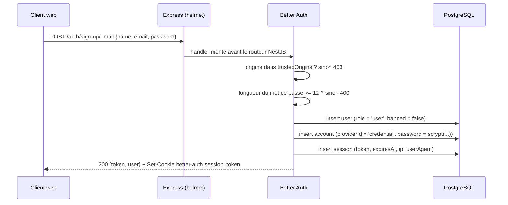
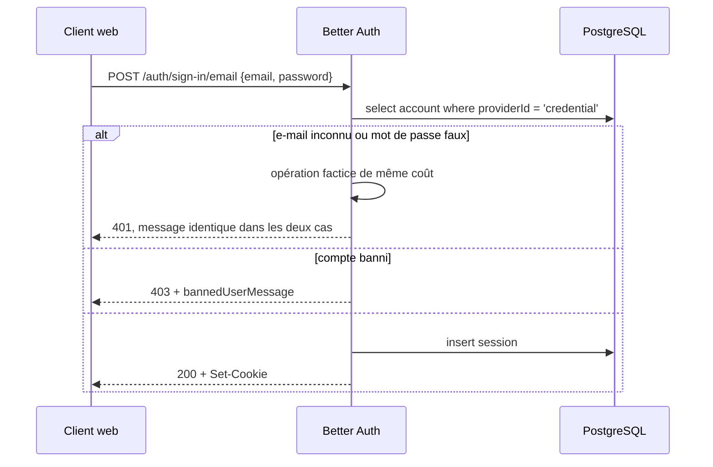
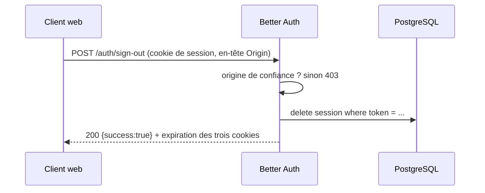
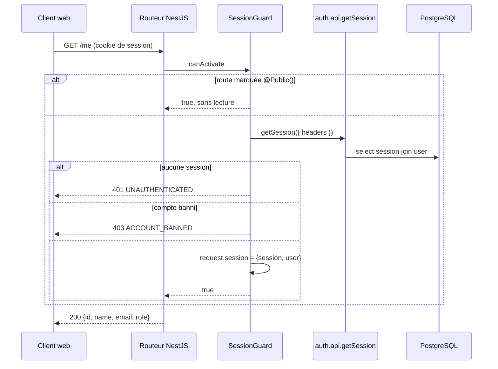
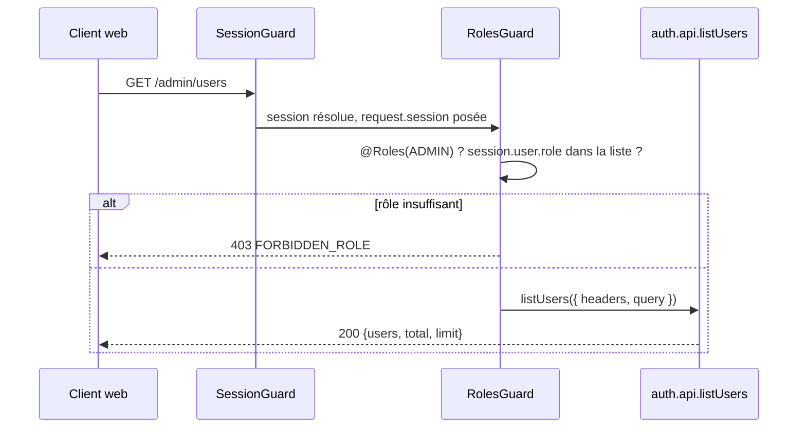
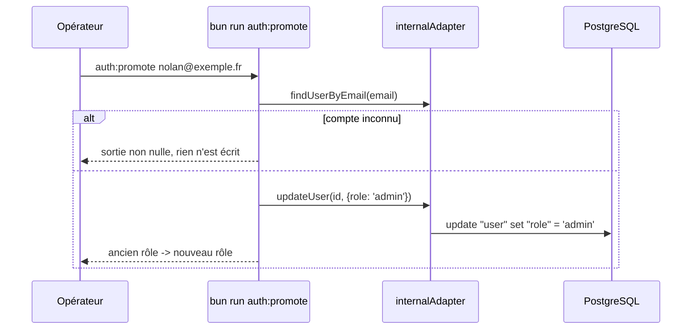
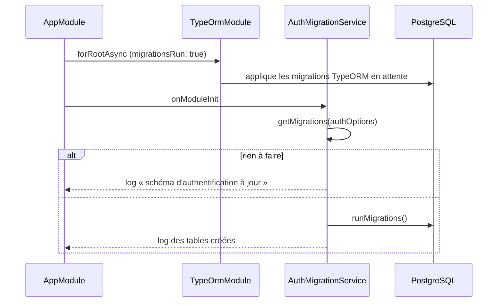

# Authentification — spécification d'implémentation

> **Source** : cahier des charges `JEB/DNI/2026-002` §3.1 (« authentification
> multi-rôles avec sessions »), documentation Better Auth 1.7.2.
> **Portée** : inscription, connexion, déconnexion, rôles `user` et `admin`,
> garde de session côté NestJS. Hors portée : partenaires, clés d'API SIRH,
> vérification d'e-mail, réinitialisation de mot de passe, fédération OAuth.
> **Vérifié contre** : `better-auth@1.7.2`, `@nestjs/common@12.0.1`,
> `express@5.2.1`, PostgreSQL 18, Bun 1.3.14.

## 1. Ce que ce lot livre

| Capacité                               | Route                                         |
| -------------------------------------- | --------------------------------------------- |
| Créer un compte salarié                | `POST /auth/sign-up/email`                    |
| Se connecter                           | `POST /auth/sign-in/email`                    |
| Se déconnecter                         | `POST /auth/sign-out`                         |
| Lire sa session                        | `GET /auth/get-session`, `GET /me`            |
| Réserver une route à l'administration  | `GET /admin/users`                            |
| Promouvoir un compte en administrateur | `bun run auth:promote <email>`                |
| Poser le schéma d'authentification     | appliqué au démarrage, `bun run auth:migrate` |

Un rôle `partner` s'ajoutera sans rien défaire : la colonne `user.role` porte
une chaîne libre et la garde compare des constantes.

## 2. Décisions verrouillées

| #   | Décision                                                                                        | Raison                                                                                                                                     |
| --- | ----------------------------------------------------------------------------------------------- | ------------------------------------------------------------------------------------------------------------------------------------------ |
| D1  | Better Auth porte toute l'authentification. Aucune entity ni migration d'auth écrite à la main. | Arbitrage du 2026-09-01. Le mot de passe, la session, le rôle et le bannissement sont du code déjà écrit et déjà audité ailleurs.          |
| D2  | Le schéma d'authentification appartient au migrateur de Better Auth, pas à TypeORM.             | §3 — TypeORM ne peut pas décrire ces tables sans les réécrire à la main, ce que D1 interdit.                                               |
| D3  | Les migrations d'auth s'appliquent **au démarrage**, comme celles de TypeORM.                   | Le dépôt promet déjà « récupérer une branche et lancer le serveur suffit à être sur son schéma ». Deux migrateurs, une seule promesse.     |
| D4  | Montage à `/auth`, pas à `/api/auth`.                                                           | Cette API n'a pas de segment `/api` — `/health`, `/docs`. Le client web doit être construit avec le même `basePath`.                       |
| D5  | Pas de plugin `organization`.                                                                   | Il modélise des espaces à plusieurs membres avec invitations ; le sujet décrit un compte partenaire unique. Refusé le 2026-09-01.          |
| D6  | Pas de `cookieCache`.                                                                           | §11 — un cache de session garde un compte banni et un rôle périmé vivants jusqu'à son expiration. Ce lot existe pour bannir et promouvoir. |
| D7  | Les identifiants d'auth restent en `text` base62, pas en UUIDv7.                                | §4.1 — la convention UUIDv7 du dépôt vise la pagination par curseur des tables métier ; les tables d'auth n'en font pas.                   |
| D8  | La bibliothèque `@thallesp/nestjs-better-auth` n'est pas utilisée.                              | §7.1 — elle déclare `@nestjs/common@^11.1.6` en peer non optionnelle, ce dépôt est en NestJS 12.                                           |
| D9  | Longueur minimale de mot de passe : 12 caractères.                                              | Recommandation ANSSI-PG-078 pour un compte sans second facteur. La valeur par défaut de la bibliothèque est 8.                             |
| D10 | Limitation de débit activée, stockée en base.                                                   | Les routes d'authentification sont la surface brute-forçable de ce lot. Le stockage mémoire perd son compteur à chaque redémarrage.        |

## 3. Pourquoi le schéma d'auth ne peut pas passer par TypeORM

La règle du dépôt est qu'aucun DDL de schéma ne s'écrit à la main : il sort de
`bun run db:generate`, qui diffe les `*.entity.ts` contre la base. Faire passer
les tables d'auth par ce chemin demanderait d'écrire cinq entities TypeORM qui
reproduisent le schéma de Better Auth colonne par colonne — donc exactement
l'entity d'auth écrite à la main que D1 interdit, et une source de vérité
dupliquée qui dérive au premier plugin ajouté.

Better Auth parle à Postgres par Kysely et publie son plan de migration comme
export documenté (`better-auth/db/migration`). Le schéma reste dérivé de la
configuration : ajouter un plugin et redémarrer suffit.

| Divergence                | Tables métier (TypeORM) | Tables d'auth (Better Auth)       |
| ------------------------- | ----------------------- | --------------------------------- |
| Nommage SQL               | `snake_case`            | `"camelCase"` cité                |
| Clé primaire              | `uuid` v7               | `text` base62                     |
| Horodatages               | `created_at`            | `"createdAt"`                     |
| Qui applique la migration | `migrationsRun: true`   | `getMigrations().runMigrations()` |

Les deux migrateurs vivent dans la même base et ne se marchent pas dessus :
TypeORM ne génère du DDL que pour les entities qu'il connaît et ignore les
tables qu'il ne déclare pas. La seule interaction réelle est `db:drop`, qui
supprime tout le schéma — il faut donc réappliquer les deux jeux après un
`db:reset`, ce que le script fait (§10).

Conséquence à porter dans le lot partenaire : une clé étrangère de
`partner.owner` vers `user.id` vise une colonne `text` que TypeORM ne décrit
pas. Elle se modélise par une entity miroir non gérée
(`@Entity({ name: 'user', synchronize: false })`, PK seule) plus un
`@ForeignKey` sur l'entity locale, pour que `db:generate` émette la contrainte
lui-même. Ce n'est pas dans ce lot, mais la forme est décidée ici.

## 4. Modèle de données

Cinq tables, générées par `auth generate`, reproduites ici telles que Postgres
les reçoit.

### 4.1 Ce que chaque table porte, et ce qui casse sans elle

| Table          | Rôle                                                                     | Sans elle                                                                                      |
| -------------- | ------------------------------------------------------------------------ | ---------------------------------------------------------------------------------------------- |
| `user`         | L'identité : e-mail unique, nom, rôle, état de bannissement.             | Rien à authentifier.                                                                           |
| `account`      | Le moyen de preuve. Le hash du mot de passe vit ici, pas sur `user`.     | Le hash finirait sur `user`, donc dans chaque projection qui sert un profil.                   |
| `session`      | Une ligne par session ouverte, avec son jeton, son IP et son user-agent. | Pas de déconnexion réelle ni de révocation à distance : un jeton signé vit jusqu'à expiration. |
| `verification` | Jetons à durée de vie courte (changement d'e-mail, réinitialisation).    | Les flux qui les consomment sont indisponibles ; la table reste vide dans ce lot.              |
| `rateLimit`    | Compteur par clé pour la limitation de débit.                            | Le compteur repart à zéro à chaque redémarrage, donc à chaque déploiement.                     |

La séparation `user` / `account` est ce qui fait qu'un mot de passe ne peut pas
fuir par une route de profil : `ClassSerializerInterceptor` ne filtre que de
vraies instances de classe, et une projection brute passerait au travers. Ici
il n'y a rien à filtrer, la colonne est dans une autre table.

### 4.2 Schéma appliqué

```sql
create table "user" ("id" text not null primary key, "name" text not null,
  "email" text not null unique, "emailVerified" boolean not null, "image" text,
  "createdAt" timestamptz default CURRENT_TIMESTAMP not null,
  "updatedAt" timestamptz default CURRENT_TIMESTAMP not null,
  "role" text, "banned" boolean, "banReason" text, "banExpires" timestamptz);

create table "session" ("id" text not null primary key,
  "expiresAt" timestamptz not null, "token" text not null unique,
  "createdAt" timestamptz default CURRENT_TIMESTAMP not null,
  "updatedAt" timestamptz not null, "ipAddress" text, "userAgent" text,
  "userId" text not null references "user" ("id") on delete cascade,
  "impersonatedBy" text);

create table "account" ("id" text not null primary key, "issuer" text not null,
  "accountId" text not null, "providerId" text not null,
  "userId" text not null references "user" ("id") on delete cascade,
  "accessToken" text, "refreshToken" text, "idToken" text,
  "accessTokenExpiresAt" timestamptz, "refreshTokenExpiresAt" timestamptz,
  "scope" text, "password" text,
  "createdAt" timestamptz default CURRENT_TIMESTAMP not null,
  "updatedAt" timestamptz not null);

create table "verification" ("id" text not null primary key,
  "identifier" text not null, "value" text not null,
  "expiresAt" timestamptz not null,
  "createdAt" timestamptz default CURRENT_TIMESTAMP not null,
  "updatedAt" timestamptz default CURRENT_TIMESTAMP not null);

create table "rateLimit" ("id" text not null primary key,
  "key" text not null unique, "count" integer not null,
  "lastRequest" bigint not null);

create index "session_userId_idx" on "session" ("userId");
create index "account_userId_idx" on "account" ("userId");
create index "verification_identifier_idx" on "verification" ("identifier");
create unique index "account_issuer_accountId_uidx" on "account" ("issuer", "accountId");
```

Les colonnes `role`, `banned`, `banReason`, `banExpires` sur `user` et
`impersonatedBy` sur `session` viennent du plugin `admin`. Les six tables
restent vanilla : aucun champ additionnel n'y est déclaré, le domaine se lie à
`user.id` par une colonne de son côté.

Cette section est la référence de la fiche de registre RGPD art. 30 exigée pour
vendredi : `user.email`, `user.name`, `session.ipAddress` et `session.userAgent`
sont les seules données à caractère personnel que ce lot collecte.

## 5. Surface HTTP

### 5.1 Routes servies par Better Auth

Better Auth publie 47 routes sous `/auth`. Celles que ce lot utilise :

| Méthode | Route                    | Rôle requis | Effet                                                       |
| ------- | ------------------------ | ----------- | ----------------------------------------------------------- |
| `POST`  | `/auth/sign-up/email`    | —           | Crée `user` + `account`, ouvre une session, pose le cookie. |
| `POST`  | `/auth/sign-in/email`    | —           | Vérifie le mot de passe, ouvre une session.                 |
| `POST`  | `/auth/sign-out`         | session     | Supprime la ligne `session`, expire les trois cookies.      |
| `GET`   | `/auth/get-session`      | session     | Renvoie `{ session, user }`, ou `null`.                     |
| `GET`   | `/auth/list-sessions`    | session     | Sessions ouvertes du compte courant.                        |
| `POST`  | `/auth/revoke-session`   | session     | Révoque une session par son jeton.                          |
| `POST`  | `/auth/change-password`  | session     | Change le mot de passe, révoque optionnellement les autres. |
| `GET`   | `/auth/admin/list-users` | `admin`     | Liste paginée des comptes.                                  |
| `POST`  | `/auth/admin/set-role`   | `admin`     | Change le rôle d'un compte.                                 |
| `POST`  | `/auth/admin/ban-user`   | `admin`     | Bannit, avec motif et échéance.                             |
| `GET`   | `/auth/ok`               | —           | Sonde de vie de la couche d'authentification.               |

### 5.2 Routes servies par NestJS

| Méthode | Route          | Garde        | Pourquoi elle existe                                                                           |
| ------- | -------------- | ------------ | ---------------------------------------------------------------------------------------------- |
| `GET`   | `/me`          | session      | Sert l'identité dans la forme documentée de cette API, sans les champs internes de la session. |
| `GET`   | `/admin/users` | rôle `admin` | Prouve que la garde de rôle refuse réellement — sans elle, le rôle est une colonne non testée. |

Elles ne peuvent pas vivre sous `/auth` : le handler monté à cette racine
termine **toute** requête du préfixe, y compris celles qu'il ne connaît pas
(`GET /auth/inexistant` → `404`, sans passer la main au routeur NestJS).

### 5.3 Routes présentes mais inopérantes

Better Auth enregistre les routes de ses fonctionnalités par défaut même quand
la configuration ne permet pas de les servir. Elles répondent proprement :

| Route                                | Réponse observée                                           |
| ------------------------------------ | ---------------------------------------------------------- |
| `POST /auth/request-password-reset`  | `400 RESET_PASSWORD_DISABLED` — aucun `sendResetPassword`. |
| `POST /auth/send-verification-email` | `400 VERIFICATION_EMAIL_NOT_ENABLED`                       |
| `POST /auth/delete-user`             | `404` — la route n'est pas enregistrée, option désactivée. |
| `POST /auth/sign-in/social`          | Aucun fournisseur configuré.                               |

Elles deviennent opérantes le jour où un envoi d'e-mail existe. C'est une
décision ouverte (§13), pas un oubli.

## 6. Fonctionnalités

### F1 — Inscription



`autoSignIn` est actif : l'inscription ouvre la session, le client n'enchaîne
pas sur une connexion. Le rôle vient de `defaultRole` du plugin `admin`, il
n'est jamais accepté depuis le corps de la requête.

### F2 — Connexion



Le message identique entre « e-mail inconnu » et « mot de passe faux » est ce
qui empêche d'énumérer les comptes du dispositif.

### F3 — Déconnexion



Les trois cookies expirés sont `better-auth.session_token`,
`better-auth.session_data` et `better-auth.dont_remember`. La ligne `session`
est supprimée, pas marquée : un jeton volé avant la déconnexion ne vaut plus
rien à la requête suivante, ce qui est précisément ce que D6 protège en
refusant le cache de session.

### F4 — Requête authentifiée sur une route métier



La garde est globale : une route est protégée sauf `@Public()` explicite. Le
défaut inverse laisserait un contrôleur non annoté ouvert, et ça ne se voit pas
en revue.

### F5 — Route réservée à l'administration



Le rôle est relu en base à chaque requête (D6). Une révocation de rôle prend
effet à la requête suivante, pas à l'expiration d'un cache.

### F6 — Amorçage du premier administrateur



Le plugin `admin` n'expose que des routes qui exigent déjà un administrateur :
sans amorçage hors bande, aucun premier administrateur ne peut exister. Le
script passe par `internalAdapter`, pas par du SQL brut, donc il reste correct
si le nom de la colonne change.

### F7 — Application du schéma au démarrage



`getMigrations` refuse d'ajouter une colonne obligatoire sans défaut à une
table déjà peuplée : elle lève `UnsafeMigrationError` plutôt que d'échouer à
mi-parcours. Ce cas fait échouer le démarrage, ce qui est le comportement
voulu — un schéma à moitié appliqué est pire qu'un process qui refuse de
démarrer.

Le démarrage émet un avertissement de la bibliothèque à chaque fois :

```
WARN [Better Auth]: Field lastRequest in table rateLimit has a different
type in the database. Expected number but got int8.
```

Son propre migrateur crée `"rateLimit"."lastRequest"` en `bigint`, et son
propre vérificateur de types ne reconnaît pas `int8` comme un `number`. Rien
n'est cassé — la limitation de débit compte et expire normalement — mais c'est
du bruit au démarrage, et personne ne doit passer une demi-heure à le chercher
dans notre code.

## 7. Intégration NestJS

### 7.1 Pourquoi pas `@thallesp/nestjs-better-auth`

| Constat                                                                                  | Conséquence                                                           |
| ---------------------------------------------------------------------------------------- | --------------------------------------------------------------------- |
| `peerDependencies` : `@nestjs/common@^11.1.6`, `@nestjs/core@^11.1.6`, non optionnelles. | Ce dépôt est en `@nestjs/common@^12.0.1`. Peer non satisfaite.        |
| Le paquet impose `bodyParser: false` sur toute l'application et réinstalle ses parseurs. | La configuration de parsing de l'API entière passe sous son contrôle. |
| Il enregistre son propre `AuthGuard` global, ses décorateurs et son layout de module.    | Deux conventions de garde et de module dans le même dépôt.            |
| Communauté, dernière publication 2026-07-04.                                             | Un correctif dépend d'un tiers.                                       |

Ce qu'il apporte réellement — monter le handler, lire la session, une garde,
deux décorateurs — tient dans une centaine de lignes écrites aux conventions du
dépôt.

### 7.2 Montage du handler

```ts
// src/main.ts
app.use(helmet({ contentSecurityPolicy: false }));
app.use(AUTH_BASE_PATH, toNodeHandler(auth));
```

Trois choses rendent ce montage correct, et elles ont été vérifiées, pas
supposées :

1. **Le chemin est reconstruit.** `app.use(path, handler)` retire le préfixe de
   `req.url` ; l'adaptateur Node de Better Auth relit `req.baseUrl` et le
   recompose, donc la route reçue est bien `/auth/sign-up/email`.
2. **Le parseur de corps de NestJS ne gêne pas.** L'adaptateur lit le flux brut
   quand il est encore lisible et, sinon, resérialise `req.body`. `bodyParser: false`
   n'est donc pas nécessaire — contrairement à ce que documente la bibliothèque
   communautaire, écrite pour des versions antérieures.
3. **L'ordre place le handler avant le routeur.** `app.use()` s'applique à
   l'instance Express immédiatement, tandis que NestJS enregistre ses parseurs
   et son routeur pendant `app.listen()`.

Helmet reste devant : ses en-têtes couvrent aussi les réponses
d'authentification (`Strict-Transport-Security`, `X-Content-Type-Options`,
`Referrer-Policy: no-referrer`, vérifié sur `POST /auth/sign-up/email`).

### 7.3 Ce que les routes `/auth` ne traversent pas

C'est la contrepartie du montage, et elle doit être lue avant d'ajouter quoi
que ce soit de global à l'application.

| Élément global               | Traverse `/auth` ? | Conséquence                                                              |
| ---------------------------- | ------------------ | ------------------------------------------------------------------------ |
| `helmet`                     | oui                | En-têtes de sécurité posés.                                              |
| `LoggingInterceptor`         | **non**            | Aucune ligne de log sur les routes d'authentification.                   |
| `ValidationPipe`             | **non**            | Better Auth valide avec ses propres schémas Zod.                         |
| `ClassSerializerInterceptor` | **non**            | Les réponses sont celles de la bibliothèque, pas des instances d'entity. |
| Document OpenAPI de NestJS   | **non**            | Les 47 routes sont absentes de `/docs` sans traitement (§7.5).           |

L'absence de log n'est pas une régression de traçabilité : la denylist de
redaction masque déjà les identifiants de connexion, et une route
d'authentification non loggée ne peut pas fuir un mot de passe par le log. Elle
devient une décision à rouvrir le jour où il faudra tracer les tentatives
échouées — `databaseHooks.session.create.after` est le point d'accroche.

### 7.4 CORS

Le frontend écoute sur `http://localhost:3000`, l'API sur `http://localhost:3001` :
origines différentes. Better Auth valide l'en-tête `Origin` pour son propre
contrôle CSRF mais **n'émet aucun en-tête CORS** — vérifié, la réponse de
`POST /auth/sign-up/email` ne porte pas d'`Access-Control-Allow-Origin`.

Sans CORS, le navigateur bloque la lecture de la réponse et le cookie n'est
jamais posé. `app.enableCors({ origin: <origines de confiance>, credentials: true })`
est donc requis, avec la **même** liste que `trustedOrigins` : deux listes qui
divergent produisent un refus dont la cause est invisible côté client.

**L'ordre est le point qui casse.** `enableCors` doit être appelé **avant** le
montage du handler, pas après. Le handler répond à tout ce qui passe sous son
préfixe et ne connaît pas `OPTIONS` : un préflight qui l'atteint reçoit `404`,
et le navigateur n'envoie jamais la connexion qui devait suivre. Mesuré dans les
deux ordres :

| Ordre                     | `OPTIONS /auth/sign-in/email`                           |
| ------------------------- | ------------------------------------------------------- |
| handler puis `enableCors` | `404`, aucun en-tête `Access-Control-*`                 |
| `enableCors` puis handler | `204` + `Access-Control-Allow-Origin` et `-Credentials` |

Un `Origin` absent ou hors liste sur une route mutante donne `403` — observé
sur `POST /auth/sign-out` appelé sans `Origin`.

### 7.5 Documentation d'API

Le plugin `openAPI` publie le schéma des routes d'authentification sur
`GET /auth/open-api/generate-schema`, et `auth.api.generateOpenAPISchema()` le
rend en mémoire. `buildOpenApiDocument()` fusionne ses `paths` et ses
`components.schemas` dans le document NestJS au démarrage, préfixés par le
`basePath`, pour que `/docs` reste le contrat complet de l'API — ce que le
cahier des charges attend comme livrable de documentation.

Le rendu Scalar par défaut du plugin est désactivé (`disableDefaultReference`) :
une seule page de documentation, celle du dépôt.

## 8. Garde de session et rôles

```
src/modules/auth/
├── auth.module.ts                     ← @Global, enregistre les deux gardes en APP_GUARD
├── controllers/auth.controller.ts     ← GET /me, GET /admin/users
├── decorators/                        ← @Public, @Roles, @CurrentUser
├── docs/                              ← un fichier par endpoint, un par code d'erreur
├── guards/                            ← SessionGuard, RolesGuard
├── services/auth.service.ts           ← seule couche qui appelle auth.api
├── validators/auth.dto.ts             ← SessionUserDto, UserListDto
└── specs/
```

`guards/` et `decorators/` sont deux dossiers que le contrat
`architecture-module-conventions` ne liste pas. Ils ne sont pas des services
déguisés : ce sont deux rôles NestJS de premier ordre, spécifiques à ce module,
et les placer dans `src/common/` ferait descendre la notion de rôle métier dans
une couche qui n'en connaît aucune. Écart assumé, à arbitrer.

`auth.service.ts` est le seul fichier qui appelle `auth.api.*`, pour la même
raison qu'un repo est le seul à toucher l'ORM : le jour où une route d'auth
change de forme, un seul fichier bouge.

| Garde          | Ce qu'elle refuse                        | Code  |
| -------------- | ---------------------------------------- | ----- |
| `SessionGuard` | Aucune session, session expirée          | `401` |
| `SessionGuard` | Compte banni, ou bannissement non expiré | `403` |
| `RolesGuard`   | Rôle absent de la liste `@Roles(...)`    | `403` |

Un « pas de session » et un « pas ton rôle » ne portent pas le même code, mais
un « cette ressource n'existe pas » et un « elle n'est pas à toi » devront
porter le même message dans les lots métier — la règle vaut pour les
ressources, pas pour l'authentification elle-même.

## 9. Configuration

`src/config/auth/auth.ts` lit `process.env` directement, sans `ConfigService`,
pour la même raison que `data-source.ts` : le CLI de schéma et le script de
promotion chargent ce fichier sans conteneur NestJS.

| Variable               | Requise | Rôle                                                                                   |
| ---------------------- | ------- | -------------------------------------------------------------------------------------- |
| `BETTER_AUTH_SECRET`   | oui     | Signe les cookies et les jetons. 32 caractères minimum, jamais commitée.               |
| `BETTER_AUTH_URL`      | oui     | URL publique de l'API. Son origine est automatiquement de confiance.                   |
| `AUTH_TRUSTED_ORIGINS` | oui     | Origines autorisées, séparées par des virgules. Alimente CORS **et** le contrôle CSRF. |
| `DATABASE_*`           | oui     | Réutilisées telles quelles ; Better Auth ouvre son propre pool `pg`.                   |

Toutes sont validées dans `src/config/env/env.schema.ts`, donc un secret absent
fait échouer le démarrage plutôt que la première inscription.

Better Auth ouvre un second pool `pg` vers la même base : il parle par Kysely et
ne peut pas emprunter la connexion de TypeORM. Deux pools au défaut de `pg`
(10 connexions chacun) contre un Postgres à 100 connexions — sans effet à cette
échelle, à revoir si un pool est dimensionné explicitement.

## 10. Cycle de vie du schéma

| Commande                    | Effet sur les tables d'auth                                  |
| --------------------------- | ------------------------------------------------------------ |
| démarrage de l'application  | Applique le plan en attente. Échoue le démarrage si non sûr. |
| `bun run auth:migrate`      | Même chose, explicitement, sans démarrer l'API.              |
| `bun run auth:show`         | Imprime le plan sans l'exécuter (`compileMigrations`).       |
| `bun run db:drop`           | Supprime **tout** le schéma, tables d'auth comprises.        |
| `bun run db:reset`          | `db:drop` puis `db:migrate` puis `auth:migrate`.             |
| `bun run db:generate <Nom>` | Ignore les tables d'auth : TypeORM ne les déclare pas.       |

Après l'ajout d'un plugin, redémarrer suffit : le plan est recalculé depuis la
configuration.

## 11. Sécurité

| Contrôle                | État dans ce lot                                                                                                     |
| ----------------------- | -------------------------------------------------------------------------------------------------------------------- |
| Hachage du mot de passe | `scrypt`, défaut de la bibliothèque. Le hash vit dans `account.password`.                                            |
| Longueur minimale       | 12 caractères (D9). L'ANSSI recommande 16 pour un administrateur ; l'option est unique, non différenciable par rôle. |
| Énumération de comptes  | Réponses et coûts identiques entre e-mail inconnu et mot de passe faux.                                              |
| CSRF                    | Validation d'`Origin` + Fetch Metadata, active. `disableCSRFCheck` reste à `false`.                                  |
| Cookies                 | `httpOnly`, `SameSite=Lax`, `Secure` en production, préfixe `better-auth.`.                                          |
| Limitation de débit     | Activée en production, stockée en base. 3 requêtes / 10 s sur `/sign-in`, `/sign-up`, `/change-password`.            |
| Révocation              | Immédiate : pas de cache de session (D6).                                                                            |
| Élévation de privilège  | `role` n'est jamais lu depuis le corps d'une requête d'inscription ; il vient de `defaultRole`.                      |
| Télémétrie              | Désactivée explicitement.                                                                                            |

Deux points restent ouverts et sont nommés comme tels : aucune vérification
d'e-mail (donc une adresse peut être fausse) et aucun second facteur.

## 12. Tests

| Niveau      | Ce qui est couvert                                                                                                                           |
| ----------- | -------------------------------------------------------------------------------------------------------------------------------------------- |
| Unitaire    | `RolesGuard` : rôle présent, absent, route sans `@Roles`. `SessionGuard` : `@Public`, absence de session, compte banni, bannissement expiré. |
| Intégration | Inscription → session → déconnexion → session refusée. Promotion → route admin acceptée. Compte `user` → route admin refusée.                |

Les tests d'intégration montent le vrai module NestJS et la vraie base, sans
mock de classe interne, conformément au skill `write-integration-tests`. Le
dépôt n'a pas encore de harnais d'intégration (`jest.config.js` unique) : le
mettre en place fait partie de ce lot ou est reporté explicitement (§13).

## 13. Décisions ouvertes

| #   | Question                                                                                                             | Bloque                                    |
| --- | -------------------------------------------------------------------------------------------------------------------- | ----------------------------------------- |
| O1  | Envoi d'e-mail : quel transport ? Sans lui, vérification d'adresse et réinitialisation restent indisponibles.        | La récupération de compte.                |
| O2  | `requireEmailVerification` : à activer en même temps que O1, sinon tout le monde est verrouillé dehors.              | Rien tant que O1 n'est pas tranché.       |
| O3  | Troisième rôle `partner`, ou appartenance déduite de `partner.owner` ?                                               | Le lot partenaire.                        |
| O4  | Harnais de tests d'intégration : dans ce lot, ou dans un lot outillage ?                                             | La couverture de §12.                     |
| O5  | Durée de session : 7 jours par défaut. Le sujet ne dit rien ; un dispositif d'avantages salariés peut vouloir moins. | Rien, la valeur est une constante.        |
| O6  | Journalisation des connexions échouées via `databaseHooks` — attendue par la fiche de registre ?                     | La fiche RGPD, si elle décrit un journal. |

## 14. Sources

- Better Auth — [Installation](https://www.better-auth.com/docs/installation)
- Better Auth — [Database](https://www.better-auth.com/docs/concepts/database)
- Better Auth — [Session Management](https://www.better-auth.com/docs/concepts/session-management)
- Better Auth — [Cookies](https://www.better-auth.com/docs/concepts/cookies)
- Better Auth — [Email & Password](https://www.better-auth.com/docs/authentication/email-password)
- Better Auth — [Rate Limit](https://www.better-auth.com/docs/concepts/rate-limit)
- Better Auth — [Admin plugin](https://www.better-auth.com/docs/plugins/admin)
- Better Auth — [OpenAPI plugin](https://www.better-auth.com/docs/plugins/open-api)
- Better Auth — [Express integration](https://www.better-auth.com/docs/integrations/express)
- Better Auth — [NestJS integration](https://www.better-auth.com/docs/integrations/nestjs)
- Better Auth — [Options reference](https://www.better-auth.com/docs/reference/options)
- npm — [`@thallesp/nestjs-better-auth`](https://www.npmjs.com/package/@thallesp/nestjs-better-auth)
- ANSSI — [Recommandations relatives à l'authentification multifacteur et aux mots de passe (ANSSI-PG-078)](https://cyber.gouv.fr/publications/recommandations-relatives-lauthentification-multifacteur-et-aux-mots-de-passe)
