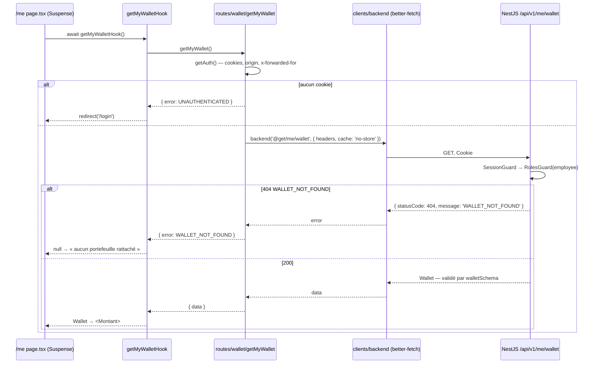
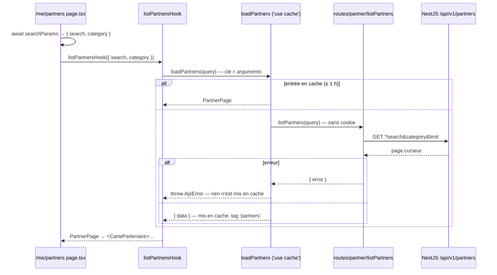
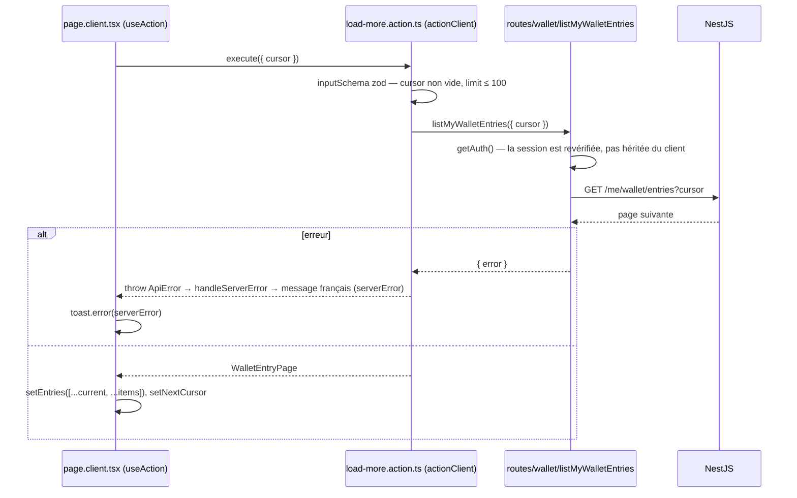

# Architecture frontend — client API typé et tableau de bord salarié

> **Sources** — conventions du frontend DiscorAds (`DiscorAds/frontend/src/lib/api/**`,
> `src/hooks/api/**`, `src/app/(app)/(protected)/dashboard/[slug]/**`,
> `.planning/codebase/{ARCHITECTURE,STRUCTURE,CONVENTIONS,STACK}.md`) ; documentation
> Next.js 16.3.4 embarquée (`apps/frontend/node_modules/next/dist/docs/`) ; contrat du
> backend sur `main` au 2026-09-04 (`apps/backend/src/**`) ; maquette
> `Epitech/tek3/Web app design with Next.js/src/App.tsx` ; `docs/design/frontend.md`
> et `docs/design/frontend-authentication.md` ; DSFR — `README.md` du dépôt
> `GouvernementFR/dsfr` (paquet `@gouvfr/dsfr` 1.15.2) et `@codegouvfr/react-dsfr`
> 1.34.0 (démo `garronej/react-dsfr-next-appdir-demo`).
>
> **Portée** — la façon dont `apps/frontend` parle au backend et s'organise pour le
> faire, transposée de DiscorAds, et son premier consommateur : l'espace salarié
> (`/me`, `/me/history`, `/me/partners`). Le document décrit ce qui est livré dans
> cette PR et ce que les lots suivants doivent respecter.
>
> **Hors portée** — les écrans `/pro` et `/admin` (leurs routes n'existent pas encore
> côté API), le paiement par QR (`/me/pay`, aucun endpoint), le backend.

---

## 1. Le problème

Le frontend de `main` sait ouvrir une session et garder trois espaces derrière une
garde de rôle, mais aucun écran ne lit encore une donnée métier : `/me` affiche le
compte, son adresse, son rôle et un bouton de déconnexion. Le backend, lui, sert
déjà le portefeuille du salarié, son historique et le catalogue des partenaires.

Il manquait la couche entre les deux : un client HTTP typé, une convention pour
appeler l'API depuis un composant serveur ou une server action, une convention de
cache, et un shell de tableau de bord. Nolan a demandé que cette couche reprenne
**exactement** celle de DiscorAds — mêmes dossiers, mêmes schémas zod, mêmes hooks,
mêmes routes parallèles, mêmes server actions `next-safe-action`.

Ce que la PR livre : cette couche, et le tableau de bord salarié de la maquette
branché dessus — sans ce que le backend ne peut pas encore alimenter.

---

## 2. Décisions verrouillées

| #       | Décision                                                                                                                                                                              | Pourquoi                                                                                                                                                                                     |
| ------- | ------------------------------------------------------------------------------------------------------------------------------------------------------------------------------------- | -------------------------------------------------------------------------------------------------------------------------------------------------------------------------------------------- |
| **A1**  | La structure de DiscorAds est reprise telle quelle : `lib/api/{clients,schemas,routes,helpers}`, `hooks/api/proxy/*.hook.ts`, `lib/cache/tags`, `lib/safe-action`.                    | Demande explicite du 2026-09-04. Une convention déjà éprouvée sur un produit en production coûte moins qu'une convention neuve à défendre.                                                   |
| **A2**  | Un seul client HTTP, `@better-fetch/fetch`, construit avec `createFetch({ schema, errorSchema })` sur `BACKEND_INTERNAL_URL + /api/v1`. **Aucun `fetch` nu** hors de lui.             | Le schéma d'endpoints est la seule source de vérité des chemins et des formes ; un appel vers une route absente du schéma ne compile pas.                                                    |
| **A3**  | Un schéma zod par DTO du backend, dans `lib/api/schemas/backend/<entité>.ts`, nommé d'après la donnée. Les montants sont des chaînes décimales (`amountSchema`), jamais des centimes. | Le backend sérialise ses colonnes `numeric` en chaînes (D6 de `frontend.md`). Une réponse qui ne correspond pas au schéma est une erreur `VALIDATION_FAILED`, pas un `undefined` silencieux. |
| **A4**  | Une fonction par endpoint dans `lib/api/routes/<ressource>/<verbe><Ressource>.ts`, qui retourne `ApiResponse<T> = { data, error: null } \| { data: null, error: code }`.              | Le code d'erreur est le contrat ; le message est libre (D7 de `frontend-authentication.md`).                                                                                                 |
| **A5**  | Un écran n'appelle jamais une route : il passe par `hooks/api/proxy/*.hook.ts`, construits avec `toHook`, qui mémoïsent et traduisent les codes en navigation.                        | `UNAUTHENTICATED` → `redirect('/login')`, `FORBIDDEN_ROLE` → `forbidden()`, `PARTNER_NOT_FOUND` → `notFound()`. Aucun code HTTP ne remonte dans un composant.                                |
| **A6**  | `cacheComponents: true`. Le catalogue est `use cache` (`cacheLife('hours')`, `cacheTag('partners')`) ; le solde et l'historique ne sont **jamais** cachés.                            | D4 et D9 de `frontend.md`. Un solde périmé en 48 px est un défaut fonctionnel.                                                                                                               |
| **A7**  | Une fonction `use cache` **jette** en cas d'erreur d'API au lieu de la retourner.                                                                                                     | La valeur de retour est ce qui est mis en cache ; une valeur jetée ne l'est jamais. Retourner `{ error }` graverait une panne réseau pour une heure.                                         |
| **A8**  | Toute écriture, et tout chargement déclenché par un clic, est une server action `next-safe-action` (`actionClient.inputSchema(...).action(...)`) qui jette `ApiError`.                | Une action est joignable par un `POST` direct : elle revérifie la session via `getAuth()` et valide son entrée par un schéma zod. `actionClient` traduit `ApiError` en message français.     |
| **A9**  | Le shell de chaque espace est un `layout.tsx` qui reçoit une route parallèle `@sidebar` (et `@breadcrumb` pour `/pro` et `/admin`), avec un `default.ts` par slot.                    | Structure DiscorAds. Le slot lit la session lui-même et streame indépendamment de la page ; `default.ts` est obligatoire depuis Next 16 (un slot sans `default` casse le build).             |
| **A10** | `experimental.authInterrupts: true`, `app/forbidden.tsx` dans le style de l'application.                                                                                              | `forbidden()` est encore expérimental dans Next 16.3 ; c'est ce que DiscorAds utilise et ce que `frontend.md` §4.4 demande.                                                                  |
| **A11** | Les libellés d'un espace vivent dans `content/<espace>.ts`. Aucune chaîne d'interface dans un composant.                                                                              | D7 de `frontend.md` : une seule locale, des formulations juridiques greppables.                                                                                                              |
| **A12** | La maquette fait foi pour le registre visuel ; les **composants** du DSFR sont adoptés pour la structure et l'accessibilité (§8).                                                     | Décision du 2026-09-03 sur le registre, demande du 2026-09-04 sur les composants. Les deux se combinent : les jetons de couleur du DSFR se surchargent, ses composants restent.              |

---

## 3. Arborescence cible

```
apps/frontend/
├── app/
│   ├── forbidden.tsx                      403 — mauvais rôle (A10)
│   ├── (public)/login  (public)/signup    inchangés
│   └── (protected)/
│       └── me/
│           ├── layout.tsx                 shell : {sidebar} + <main> + <RoleGate>
│           ├── @sidebar/
│           │   ├── page.tsx               lit la session, rend <DashboardChrome>
│           │   └── default.ts             ré-exporte page.tsx (navigation dure)
│           ├── page.tsx                   /me — solde, derniers mouvements
│           ├── loading.tsx  error.tsx  skeletons.tsx
│           ├── history/
│           │   ├── page.tsx               première page, serveur
│           │   ├── page.client.tsx        accumulation, « Charger plus »
│           │   ├── actions/load-more.action.ts
│           │   └── loading.tsx
│           └── partners/
│               ├── page.tsx               filtres depuis l'URL, catalogue caché
│               ├── page.client.tsx        recherche, puces, « Charger plus »
│               ├── actions/load-more.action.ts
│               ├── skeletons.tsx  loading.tsx
│
├── lib/
│   ├── api/
│   │   ├── index.ts                       ré-export clients + helpers + routes + schemas
│   │   ├── clients/
│   │   │   ├── index.ts                   { backend, ECODES, BackendErrorCode }
│   │   │   └── backend/
│   │   │       ├── index.ts               createFetch, retry 5xx, ECODES
│   │   │       └── endpoints/             wallet.ts  partner.ts  partner-category.ts
│   │   ├── schemas/
│   │   │   ├── common/                    amount.ts  cursor-page.ts
│   │   │   └── backend/                   wallet.ts  wallet-entry.ts  partner.ts  partner-category.ts  error.ts
│   │   ├── routes/
│   │   │   ├── index.ts                   export const api = { wallet, partner, partnerCategory }
│   │   │   ├── wallet/                    getMyWallet.ts  listMyWalletEntries.ts
│   │   │   ├── partner/                   listPartners.ts  getPartner.ts
│   │   │   └── partner-category/          listPartnerCategories.ts  getPartnerCategory.ts
│   │   └── helpers/                       types.ts  errors.ts  toHook.ts
│   ├── cache/tags/                        partner.ts  partner-category.ts
│   ├── safe-action/index.ts               actionClient
│   ├── log/index.ts                       logger, throwNextError
│   ├── auth/                              inchangé — getAuth() est réutilisé tel quel
│   └── env.ts                             inchangé — backendInternalUrl()
│
├── hooks/api/
│   ├── index.ts
│   └── proxy/                             wallet.hook.ts  partner.hook.ts  partner-category.hook.ts
│
├── components/
│   ├── composites/                        montant  date-texte  page-header  mouvement-ligne  carte-partenaire  sidebar/
│   ├── icons/index.tsx                    icônes de la maquette
│   └── views/route-error.tsx
│
├── constants/api-errors.ts                code → message français
└── content/me.ts                          libellés de l'espace salarié (A11)
```

Trois règles de revue, reprises de `frontend.md` §3.2 :

1. Un composant ou une page qui importe `lib/api/clients` ou `lib/api/routes` est un
   défaut : seuls `hooks/api` et les server actions le font.
2. Un `fetch` en dehors de `lib/api/clients` est un défaut.
3. Une chaîne d'interface en dehors de `content/` est un défaut.

---

## 4. La couche d'accès aux données

### 4.1 Client (`lib/api/clients/backend`)

```ts
const backendSchema = createSchema({
  ...walletEndpointsSchema,
  ...partnerEndpointsSchema,
  ...partnerCategoryEndpointsSchema,
});

createFetch({
  baseURL: `${backendInternalUrl()}/api/v1`,
  schema: backendSchema,
  errorSchema: backendErrorSchema, // { statusCode, message, error? } — le corps Nest
  catchAllError: true,
  retry: {
    type: 'exponential',
    attempts: 3,
    baseDelay: 200,
    maxDelay: 2000,
    shouldRetry: (r) => r !== null && r.status >= 500,
  },
});
```

Le client est construit au **premier appel**, pas à l'import : `next build` évalue le
module en collectant les pages, sur une machine qui n'a pas `BACKEND_INTERNAL_URL`.

Un endpoint se déclare une fois, avec ses schémas :

```ts
// lib/api/clients/backend/endpoints/wallet.ts
export const walletEndpointsSchema = {
  '@get/me/wallet': { method: 'get', output: walletSchema },
  '@get/me/wallet/entries': {
    method: 'get',
    query: paginationQuerySchema,
    output: walletEntryPageSchema,
  },
} satisfies Parameters<typeof createSchema>[0];
```

`ECODES` liste les codes que le frontend connaît : les cinq du backend
(`UNAUTHENTICATED`, `ACCOUNT_BANNED`, `FORBIDDEN_ROLE`, `WALLET_NOT_FOUND`,
`PARTNER_NOT_FOUND`) et six produits côté client (`BAD_REQUEST`,
`INTERNAL_SERVER_ERROR`, `VALIDATION_FAILED`, `ERR_API_CONNECTION_REFUSED`,
`ERR_API_FETCH_FAILED`, `UNKNOWN_ERROR`). `handleApiError` lit d'abord
`error.message` — c'est là que Nest met le code — puis classe par statut.

### 4.2 Routes (`lib/api/routes`)

Une route privée transmet la session reconstruite par `getAuth()` (cookies, `origin`,
`x-forwarded-for`) et court-circuite sans cookie :

```ts
export const getMyWallet = cache(async (): Promise<ApiResponse<Wallet>> => {
  const auth = await getAuth();
  if (!auth.hasToken) return { data: null, error: ECODES.UNAUTHENTICATED };

  const { data, error } = await backend('@get/me/wallet', {
    headers: auth.headers,
    cache: 'no-store',
  });
  if (error) return handleApiError<Wallet>(error);
  return { data, error: null };
});
```

Une route publique (`listPartners`, `getPartner`) ne lit **pas** les cookies : c'est
ce qui l'autorise à tourner dans une portée `use cache`, où `cookies()` est interdit.

> Mesuré sur le backend : `GET /partners/categories` n'est **pas** `@Public()` — la
> liste des catégories exige une session. La route `listPartnerCategories` transmet
> donc `auth.headers`, et le catalogue partenaires ne peut pas être entièrement statique.
> `GET /partners/categories/:slug` répond un **corps vide** (200) pour un slug inconnu,
> pas un 404 : le schéma de sortie est `nullable()`.

### 4.3 Hooks (`hooks/api/proxy`)

`toHook(name, route, options)` enveloppe une route dans `cache()` de React et traduit
les erreurs. Trois configurations existent dans ce lot :

| Hook                        | Cache                                                  | Erreurs                                                                                                                                                 |
| --------------------------- | ------------------------------------------------------ | ------------------------------------------------------------------------------------------------------------------------------------------------------- |
| `getMyWalletHook`           | aucun                                                  | `UNAUTHENTICATED` / `ACCOUNT_BANNED` → `/login` ; `FORBIDDEN_ROLE` → `forbidden()` ; `WALLET_NOT_FOUND` → `null` (état rendu par l'écran) ; sinon jette |
| `listMyWalletEntriesHook`   | aucun                                                  | idem                                                                                                                                                    |
| `listPartnersHook`          | `use cache`, `hours`, tag `partners`                   | la fonction cachée jette `ApiError` — jamais mise en cache (A7)                                                                                         |
| `getPartnerHook`            | `use cache`, `hours`, tags `partners` + `partner-{id}` | `PARTNER_NOT_FOUND` → `notFound()`                                                                                                                      |
| `listPartnerCategoriesHook` | aucun (session)                                        | navigation comme le portefeuille                                                                                                                        |

### 4.4 Lecture privée — le solde



### 4.5 Lecture publique cachée — le catalogue



### 4.6 « Charger plus » — server action



Le bouton disparaît quand `nextCursor` est `null`. Le catalogue suit le même motif,
son action appelant la **même** fonction cachée `loadPartners` que la page.

---

## 5. Le shell et les routes parallèles

```tsx
// app/(protected)/me/layout.tsx
export default function Layout({ children, sidebar }: LayoutProps<'/me'>) {
  return (
    <div className="min-h-screen bg-[color:var(--background)]">
      <Suspense fallback={null}>{sidebar}</Suspense>
      <main id="contenu" className="min-h-screen pb-[72px] pt-[56px] md:pb-0 md:pl-[240px] md:pt-0">
        <div className="mx-auto max-w-3xl px-4 py-6 md:px-8 md:py-8">
          <Suspense fallback={…}>
            <RoleGate role={ROLES.EMPLOYEE}>{children}</RoleGate>
          </Suspense>
        </div>
      </main>
    </div>
  );
}
```

- `@sidebar/page.tsx` lit `getCurrentUser()` et rend `<DashboardChrome>` : barre
  latérale de 240 px sur `md:`, barre supérieure et barre d'onglets basse en dessous —
  positions de l'`AppShell` de la maquette.
- `@sidebar/default.ts` ré-exporte `page.tsx`, comme DiscorAds : après un
  rechargement sur `/me/history`, le slot n'a pas de sous-page `history` et rend le
  `default`, qui est la même barre.
- La session est lue **deux fois** par requête (slot et `RoleGate`) mais une seule
  fois sur le fil : `getCurrentUser` est dans `cache()` de React.
- `LayoutProps<'/me'>` porte le slot typé : `next typegen` régénère
  `.next/types/routes.d.ts` (`"/me": "sidebar"`).
- `/pro` et `/admin` ajouteront `@breadcrumb`, avec une sous-page par route pour
  porter `generateMetadata` et le fil d'Ariane sans remonter le layout — le motif
  DiscorAds `@breadcrumb/<route>/page.tsx`. `/me` n'en a pas (D10 de `frontend.md`).

Fichiers système : `loading.tsx` (squelette qui reprend la grille de l'écran),
`error.tsx` (délègue à `components/views/route-error.tsx`), `app/forbidden.tsx`.

---

## 6. Ce qui est caché, streamé ou privé

| Lecture               | Directive               | `cacheLife` | `cacheTag`                 | Invalidée par                                                |
| --------------------- | ----------------------- | ----------- | -------------------------- | ------------------------------------------------------------ |
| Catalogue partenaires | `use cache`             | `hours`     | `partners`                 | `updateTag('partners')` — décision d'instruction (lot admin) |
| Fiche partenaire      | `use cache`             | `hours`     | `partners`, `partner-{id}` | idem, ou mise à jour du profil                               |
| Catégories            | aucune (session)        | —           | —                          | — (à passer en `use cache` si la route devient publique)     |
| Solde                 | aucune — `<Suspense>`   | —           | —                          | — (D9)                                                       |
| Historique            | aucune — `<Suspense>`   | —           | —                          | — (D9)                                                       |
| Session               | `cache()` de React seul | —           | —                          | — (D4 de `frontend-authentication.md`)                       |

Rappels tirés de la documentation Next 16 : une portée `use cache` ne peut pas lire
`cookies()`, `headers()` ni `searchParams` — l'erreur `next-request-in-use-cache`
peut passer le build et n'apparaître qu'au `next start`. Les arguments sont la clé
de cache, en clair : aucune donnée personnelle n'y entre. `revalidateTag` prend
désormais deux arguments (`tag, 'max'`) ; `updateTag` n'existe que dans une action.

---

## 7. Mutations

`lib/safe-action/index.ts` :

```ts
export const actionClient = createSafeActionClient({
  handleServerError(error) {
    if (error instanceof ApiError) return API_ERROR_MESSAGES[error.code];
    console.error(error);
    return API_ERROR_MESSAGES.UNKNOWN_ERROR;
  },
});
```

| Action                        | Écran          | Entrée (zod)              | Effet                          | Livrée               |
| ----------------------------- | -------------- | ------------------------- | ------------------------------ | -------------------- |
| `loadMoreWalletEntriesAction` | `/me/history`  | `cursor`, `limit?`        | page suivante, rien d'invalidé | oui                  |
| `loadMorePartnersAction`      | `/me/partners` | `listPartnersQuerySchema` | page suivante depuis le cache  | oui                  |
| `signOut`                     | shell          | —                         | client Better Auth, `/login`   | oui (existant)       |
| `createPaymentToken`          | `/me/pay`      | —                         | —                              | non — aucun endpoint |
| `decideRegistration`…         | `/admin/*`     | voir `frontend.md` §3.6   | `updateTag('partners')`        | non                  |

Côté client, `useAction` de `next-safe-action/hooks` fournit `execute`, `isPending`,
`onSuccess`, `onError` ; le message d'échec arrive dans `error.serverError`.
`@next-safe-action/adapter-react-hook-form` n'est **pas** ajouté : DiscorAds ne
l'utilise pas non plus (vérifié — le motif réel est `useAction` + `useForm` +
`zodResolver`), et ce lot n'a pas de formulaire.

---

## 8. Design

### 8.1 Registre visuel — la maquette fait foi

Les jetons de `app/globals.css` sont alignés sur `Web app design with Next.js/src/index.css` :

| Jeton                       | Valeur                                                                            |
| --------------------------- | --------------------------------------------------------------------------------- |
| `--background`              | `#F5F5F3`                                                                         |
| `--foreground`              | `#1A1A2E`                                                                         |
| `--primary`                 | `#1B3A6B`                                                                         |
| `--secondary`               | `#EEF1F7`                                                                         |
| `--muted`                   | `#F0F0EE` / texte `#6B7280`                                                       |
| `--accent`, `--destructive` | `#D93B3B`                                                                         |
| `--border`                  | `#DDE1EA`                                                                         |
| `--radius`                  | `4px`                                                                             |
| Ombres                      | aucune                                                                            |
| Boutons                     | contour uniquement                                                                |
| Montants                    | `.font-mono-data` → Geist Mono, mention « (simulation) » accolée dans `<Montant>` |

Polices : Marianne (`font-display`) et Spectral (`font-serif`), déjà dans le dépôt.
La maquette utilise DM Sans / DM Mono ; le dépôt a tranché pour Marianne et Geist
Mono — l'écart est assumé, pas rouvert ici.

### 8.2 Implémentation des composants du DSFR

Demande du 2026-09-04 : la spécification décrit l'implémentation des composants du
Système de Design de l'État tels que la page « Prise en main » du site les présente.
Le site (`systeme-de-design.gouv.fr`) refuse les requêtes automatisées (Cloudflare) ;
les faits ci-dessous viennent du `README.md` du dépôt `GouvernementFR/dsfr` et de
`@codegouvfr/react-dsfr`, qui en sont la source. À vérifier sur la page au moment
d'ouvrir le lot.

**Ce que le DSFR impose (vanilla, `@gouvfr/dsfr` 1.15.2)**

- Installation : `npm install @gouvfr/dsfr` (variable `DSFR_ACCEPT_LICENSE=1` en CI —
  la licence n'autorise l'usage qu'aux sites de l'État ; voir O2).
- Fichiers à servir : `dsfr.min.css`, `utility/utility.min.css`, `dsfr.module.min.js`
  (`type="module"`) **et** `dsfr.nomodule.min.js` (`nomodule`), les dossiers `fonts/`,
  `icons/`, `favicon/`. `utility.min.css` doit être un niveau sous `icons/`.
- `<html lang="fr" data-fr-scheme="system">` pour les thèmes clair / sombre, un script
  anti-flash dans `<head>`, les deux scripts JS en fin de `<body>`.
- Nomenclature BEM : classes `fr-*` (`fr-btn`, `fr-card`, `fr-badge`, `fr-tag`,
  `fr-sidemenu`, `fr-tabs`, `fr-alert`, `fr-breadcrumb`, `fr-header`, `fr-footer`,
  `fr-search-bar`, `fr-skiplinks`). Chaque composant liste ses dépendances CSS/JS dans
  son `README.md` ; on peut n'importer que `core` + `scheme` + les composants utilisés.
- Les composants s'instancient seuls depuis le HTML ; `window.dsfr(element)` expose
  l'API JavaScript (ouvrir une modale, changer d'onglet).

**Ce que Next impose**

Les scripts DSFR manipulent le DOM après hydratation et gèrent eux-mêmes le mode
sombre ; la voie sans surprise dans l'App Router est `@codegouvfr/react-dsfr` 1.34.0,
qui embarque le DSFR, expose chaque composant en React et sait se brancher sur
`next/link`. Ce que la démo officielle Next 16 App Router met en place :

```jsonc
// package.json
"predev":   "react-dsfr optimize-css",
"prebuild": "react-dsfr optimize-css"
```

```tsx
// lib/dsfr/server-only-index.tsx
import { DsfrHeadBase, createGetHtmlAttributes } from '@codegouvfr/react-dsfr/next-app-router/server-only-index';
export const { getHtmlAttributes } = createGetHtmlAttributes({ defaultColorScheme: 'light' });
export function DsfrHead(props) { return <DsfrHeadBase Link={Link} {...props} />; }

// lib/dsfr/index.tsx  ('use client')
import { DsfrProviderBase, StartDsfrOnHydration } from '@codegouvfr/react-dsfr/next-app-router';
export function DsfrProvider(props) { return <DsfrProviderBase defaultColorScheme="light" Link={Link} {...props} />; }
export { StartDsfrOnHydration };

// app/layout.tsx
<html {...getHtmlAttributes({ lang: 'fr' })}>
  <head><DsfrHead preloadFonts={['Marianne-Regular', 'Marianne-Medium', 'Marianne-Bold']} /></head>
  <body><DsfrProvider lang="fr">{children}</DsfrProvider></body>
</html>

// chaque page.tsx
<StartDsfrOnHydration />
```

Les composants s'importent un par un — `@codegouvfr/react-dsfr/Button`, `/Badge`,
`/Card`, `/Tabs`, `/Alert`, `/Breadcrumb`, `/SideMenu`, `/Header`, `/Footer`,
`/SearchBar`, `/Tag`, `/SkipLinks` — et `fr.cx('fr-mt-7v')` compose les classes
utilitaires. `defaultColorScheme: 'light'` fige le thème clair : le registre de la
maquette n'a pas de variante sombre.

**Correspondance maquette → DSFR**, à appliquer écran par écran dans le lot design :

| Élément de la maquette                        | Composant DSFR                                                | Ce qui change                                                                      |
| --------------------------------------------- | ------------------------------------------------------------- | ---------------------------------------------------------------------------------- |
| Bloc-marque (bande tricolore + intitulé)      | `Header` — `brandTop`, `serviceTitle`                         | La bande tricolore devient celle du DSFR ; le nom du service reste « Ticket Tout » |
| Barre latérale `/me`                          | `SideMenu`                                                    | `aria-current`, repli mobile gérés par le composant                                |
| Barre d'onglets basse (mobile)                | aucun équivalent                                              | conservée telle quelle, sous `md:`                                                 |
| Bouton contour                                | `Button` `priority="secondary"`                               | même sémantique (contour), taille et focus du DSFR                                 |
| Carte de solde, carte de partenaire           | `Card`                                                        | `border`, `size`, `enlargeLink` pour la carte cliquable                            |
| Pastille de statut, puce de catégorie         | `Badge` (statut), `Tag` (catégorie, `pressed` pour le filtre) | la couleur seule ne porte jamais l'information                                     |
| Recherche du catalogue                        | `SearchBar`                                                   | libellé, bouton, `role="search"`                                                   |
| Onglets de statut (`/admin/partners`)         | `Tabs`                                                        | —                                                                                  |
| Bandeaux (simulation, portefeuille désactivé) | `Alert` `severity="info" / "warning"`                         | fermeture facultative                                                              |
| Fil d'Ariane (`/pro`, `/admin`)               | `Breadcrumb`                                                  | alimenté par le slot `@breadcrumb`                                                 |
| Lien d'évitement                              | `SkipLinks`                                                   | cible `#contenu`, déjà posé sur `<main>`                                           |
| Chargement                                    | squelettes maison                                             | le DSFR n'a pas de squelette                                                       |

**Coexistence avec Tailwind** : le DSFR pose ses styles sur ses propres classes
`fr-*` et sur des variables `--*` préfixées ; Tailwind 4 reste pour la mise en page
(grille, espacements du shell). Règle : un composant est **soit** DSFR, **soit**
Tailwind — jamais des utilitaires de couleur Tailwind sur un composant `fr-*`. Les
jetons de la maquette (§8.1) se posent en surcharge des variables DSFR
(`--background-action-high-blue-france` → `#1B3A6B`, etc.) dans `globals.css`, après
l'import DSFR.

**Ce que ce lot ne fait pas** : il n'installe ni `@gouvfr/dsfr` ni `react-dsfr`. Les
écrans livrés reproduisent la maquette avec des primitives maison, comme les écrans
d'authentification. La bascule vers les composants DSFR est un lot à part (§12),
parce qu'elle touche `app/layout.tsx`, les polices et les écrans existants d'un coup.

---

## 9. Contrat backend consommé

Toutes les routes sont sous `/api/v1` (`bootstrap.ts` : préfixe `api`, version `1`).

| Route                            | Garde                 | Entrée                                                 | Sortie (schéma zod)                | Erreurs                                                                                |
| -------------------------------- | --------------------- | ------------------------------------------------------ | ---------------------------------- | -------------------------------------------------------------------------------------- |
| `GET /me/wallet`                 | session + `employee`  | —                                                      | `walletSchema`                     | 401 `UNAUTHENTICATED`, 403 `FORBIDDEN_ROLE` / `ACCOUNT_BANNED`, 404 `WALLET_NOT_FOUND` |
| `GET /me/wallet/entries`         | session + `employee`  | `cursor?` (base64url), `limit?` 1–100, défaut 20       | `walletEntryPageSchema`            | idem + 400 « Invalid pagination cursor »                                               |
| `GET /partners`                  | `@Public()`           | `search?` ≤ 100, `category?` slug, `cursor?`, `limit?` | `partnerPageSchema`                | 400                                                                                    |
| `GET /partners/:id`              | `@Public()`           | UUID v7                                                | `partnerSchema`                    | 404 `PARTNER_NOT_FOUND` (inclut « non actif »)                                         |
| `GET /partners/categories`       | session (pas de rôle) | —                                                      | `partnerCategorySchema[]`          | 401                                                                                    |
| `GET /partners/categories/:slug` | session               | slug                                                   | `partnerCategorySchema.nullable()` | corps vide si inconnu                                                                  |

Les listes sont ordonnées par `id DESC` (UUID v7, donc par date de création) et
paginées par curseur `base64url(id)`. Le libellé d'une écriture est le nom commercial
du partenaire pour un paiement, le libellé de l'abondement pour un crédit, `null`
sinon — le frontend n'invente rien à sa place (`entryTitle`).

---

## 10. Ce qui est exclu de ce lot, et pourquoi

| Élément de la maquette                            | Sort          | Raison                                                                         |
| ------------------------------------------------- | ------------- | ------------------------------------------------------------------------------ |
| Écran « Payer » (`/me/pay`, QR, compte à rebours) | **retiré**    | aucun endpoint de jeton de paiement sur `main` (PR #36 en cours côté backend)  |
| Bouton « Générer un code » sur `/me`              | **retiré**    | même raison ; la grille d'actions passe à une colonne, pas un bouton désactivé |
| Entrée « Payer » dans la navigation               | **retirée**   | idem                                                                           |
| Statut, SIREN, objet social d'un partenaire       | **retirés**   | absents du DTO public ; le catalogue ne sert que les partenaires actifs        |
| Sous-titre « Mouvements des 30 derniers jours »   | **reformulé** | l'API n'a pas de filtre de période ; le texte disait une chose fausse          |
| `MOCK_*`, sélecteur de rôle au login              | **absents**   | la session porte le rôle                                                       |

Le catalogue est servi sous `/me/partners`, dans le shell salarié, comme dans la
maquette (vue `employee-catalog`). `frontend.md` prévoit `/partners` en public et
`/pro/partners` : le composant `<CartePartenaire>` et `page.client.tsx` sont conçus
pour être réutilisés par ces deux hôtes.

---

## 11. Gates et vérification

| Gate                      | Commande                                             | État à l'ouverture de la PR |
| ------------------------- | ---------------------------------------------------- | --------------------------- |
| Types                     | `bunx tsc --noEmit` dans `apps/frontend`             | voir description de la PR   |
| Lint                      | `bunx eslint <fichiers du lot>`                      | idem                        |
| Build (`cacheComponents`) | `bunx next build` dans `apps/frontend`               | idem                        |
| Format                    | `bunx prettier --check` sur les fichiers du lot      | idem                        |
| Rendu réel                | dev sur `:3000`, backend `:3001`, base locale seedée | idem                        |

`apps/frontend/package.json` n'a pas de scripts `typecheck` / `lint:check` : la CI
racine (`turbo run typecheck lint:check`) ne vérifie donc **pas** le frontend
aujourd'hui. Deux PR ouvertes (#24, #28) s'en occupent ; ce lot ne les double pas.

---

## 12. Décisions ouvertes

| #      | Question                                                                                                                                               | Ce qui bloque                                                                                                                         | Qui tranche    |
| ------ | ------------------------------------------------------------------------------------------------------------------------------------------------------ | ------------------------------------------------------------------------------------------------------------------------------------- | -------------- |
| **O1** | Adopter `@codegouvfr/react-dsfr` (composants React + assets embarqués) ou le DSFR vanilla (`fr-*` + scripts) ?                                         | La démo Next 16 App Router n'existe que pour react-dsfr ; le vanilla impose un `<Script>` par fichier JS et une hydratation à la main | Nolan          |
| **O2** | Licence du DSFR : son usage est réservé aux sites de l'État (`DSFR_ACCEPT_LICENSE`). Un projet d'école qui simule un ministère fictif y a-t-il droit ? | À relire sur le dépôt avant d'installer le paquet ; la mémoire du projet notait déjà que la marque et le Bleu France sont réservés    | Nolan + équipe |
| **O3** | `GET /partners/categories` doit-il devenir `@Public()` ?                                                                                               | Tant qu'il exige une session, le catalogue ne peut pas être une coquille statique complète                                            | Backend        |
| **O4** | `/me/partners` (shell salarié, maquette) **et** `/partners` (public, spéc) : les deux, ou un seul ?                                                    | Deux hôtes du même composant ; la spéc prévoit déjà `/pro/partners` en second hôte                                                    | Nolan          |
| **O5** | Historique : filtre de période dans l'URL (spéc §6.7) — l'API ne l'a pas.                                                                              | Un paramètre `from`/`to` sur `GET /me/wallet/entries`                                                                                 | Backend        |

---

## 13. Sources

- DiscorAds — `frontend/src/lib/api/{clients,schemas,routes,helpers}`, `src/hooks/api/proxy/*.hook.ts`,
  `src/lib/safe-action/index.ts`, `src/app/(app)/(protected)/dashboard/[slug]/{layout.tsx,@sidebar,@breadcrumb}`,
  `.planning/codebase/ARCHITECTURE.md`, `STRUCTURE.md`, `CONVENTIONS.md`.
- Next.js 16.3.4, `apps/frontend/node_modules/next/dist/docs/01-app/` :
  `01-getting-started/08-caching.md`, `02-guides/authentication-with-cache-components.md`,
  `03-api-reference/03-file-conventions/parallel-routes.md`, `default.md`,
  `03-api-reference/04-functions/{cacheTag,updateTag,revalidateTag,cacheLife}.md`,
  `03-api-reference/05-config/01-next-config-js/cacheComponents.md`, `01-directives/use-cache.md`.
- Backend — `apps/backend/src/bootstrap.ts`, `modules/wallets/**`, `modules/partners/**`,
  `common/pagination/*`, `common/constants/error-codes.constant.ts`, `common/guards/*`.
- DSFR — `https://github.com/GouvernementFR/dsfr` (`README.md`, sections « Configuration
  de votre projet », « Le HTML », « Les CSS », « Thèmes », « Le Javascript »),
  `https://www.npmjs.com/package/@gouvfr/dsfr` (1.15.2),
  `https://github.com/codegouvfr/react-dsfr` (1.34.0), `https://react-dsfr.codegouv.studio/`,
  `https://github.com/garronej/react-dsfr-next-appdir-demo` (`src/app/layout.tsx`, `src/dsfr-bootstrap/*`, `package.json`).
- `docs/design/frontend.md` (D1–D10, §3.2, §3.5, §6.6–6.8) ; `docs/design/frontend-authentication.md` (D1–D9, F5).
