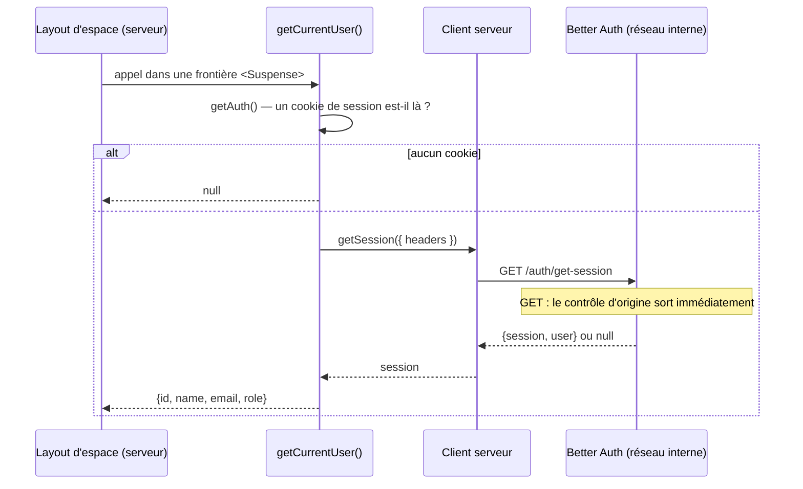
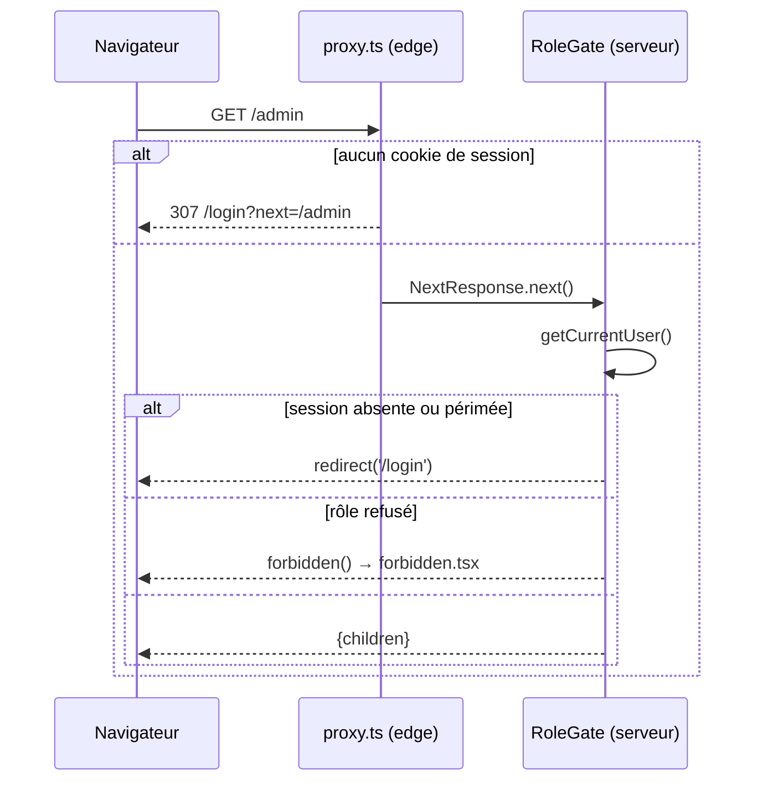
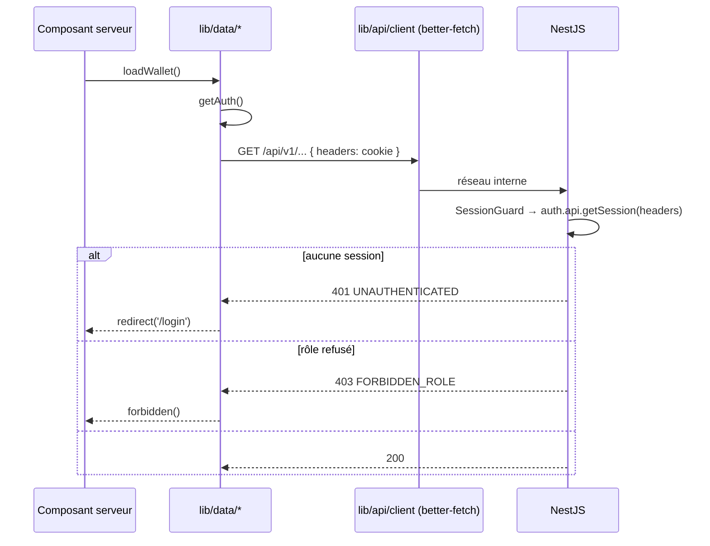

# Authentification frontend — spécification d'implémentation

> **Sources** — `docs/design/authentication.md` (backend, mergée le 2026-09-02) ;
> `docs/design/frontend.md` §3.2, §3.4, §3.6, §3.7, §6.2, lot `F-B` ; architecture
> DiscorAds (`frontend/src/config/better-auth.config.ts`,
> `src/lib/api/helpers/cookieHeader.ts`, `src/lib/api/routes/session/getSession.ts`,
> `src/app/(app)/(protected)/middleware.ts`).
>
> **Portée** — comment le frontend ouvre une session, la porte, la lit, la garde et la
> ferme : les deux clients, les en-têtes transmis, les cookies, la garde des trois
> espaces, la traduction des erreurs, les tests.
>
> **Hors portée** — le dessin des écrans (`frontend.md` §6), le client de l'API métier
> (`lib/api/*`, lot `F-A`), l'inscription salarié, la vérification d'e-mail et la
> réinitialisation de mot de passe (`O1` de `authentication.md`), les clés d'API.
>
> **Vérifié contre** — `better-auth@1.7.2` et `better-call@1.4.0` lus dans
> `apps/backend/node_modules`, `next@16.3.4` et sa documentation embarquée
> (`apps/frontend/node_modules/next/dist/docs/`), `main` à `0a7f2e7`.

---

## 1. Ce que ce lot livre

| Capacité                              | Servi par                                                 |
| ------------------------------------- | --------------------------------------------------------- |
| Se connecter                          | `authClient.signIn.email()` depuis `/login`               |
| Se déconnecter                        | `authClient.signOut()` depuis le shell                    |
| Connaître l'utilisateur courant       | `getCurrentUser()`, côté serveur                          |
| Rediriger un anonyme hors des espaces | `proxy.ts`, sur présence du cookie                        |
| Refuser un espace au mauvais rôle     | `<RoleGate>`, dans le layout de chaque espace             |
| Porter la session vers une lecture    | `getAuth()` → en-têtes `Cookie` et `Origin`               |
| Administrer les comptes               | `authClient.admin.*` depuis une server action (lot `F-J`) |

Le lot est `F-B` du §10 de `frontend.md`. Il dépend de `F-A` pour `lib/safe-action.ts`
et les pages système, et de deux correctifs d'artefact (§3.5) sans lesquels il ne
fonctionne dans aucun environnement livré.

---

## 2. Décisions verrouillées

| #      | Décision                                                                                                                 | Pourquoi                                                                                                                                                                                                                                                      |
| ------ | ------------------------------------------------------------------------------------------------------------------------ | ------------------------------------------------------------------------------------------------------------------------------------------------------------------------------------------------------------------------------------------------------------- |
| **D1** | Le navigateur appelle `/auth/*` sur **sa propre origine**, jamais sur celle du backend.                                  | Cookie de première partie, aucun CORS, aucune URL publique figée au build : sans `baseURL`, le client résout `window.location.origin + basePath` (mesuré, `dist/utils/url.mjs`). L'edge route `/auth` vers le backend — §3.5.                                 |
| **D2** | `D2` de `frontend.md` — « le navigateur ne parle jamais à l'API directement » — gagne **une exception nommée**, `/auth`. | La règle protège de deux choses : un jeton dans le bundle et du CORS. Ni l'un ni l'autre ici : même origine, cookie `HttpOnly` que le JavaScript ne lit pas. Les dix autres mutations de `frontend.md` §3.6 restent des server actions.                       |
| **D3** | Deux clients : `lib/auth/client.ts` (navigateur) et `lib/auth/server.ts` (`server-only`, `baseURL` interne).             | Mesuré : sans `baseURL` et hors navigateur, `getClientConfig` retombe sur la chaîne littérale `'/api/auth'`, que `fetch` refuse côté Node. Le conteneur Next ne résout pas non plus le nom public de l'artefact.                                              |
| **D4** | La session n'est **jamais** mise en cache de rendu : ni `use cache`, ni `use cache: private`.                            | §4.4. Un cache de session réintroduit exactement ce que `D6` de `authentication.md` a retiré.                                                                                                                                                                 |
| **D5** | `proxy.ts` ne vérifie que la **présence** du cookie, jamais sa validité.                                                 | Documentation Next : « Proxy is _not_ intended for slow data fetching ». La validité est revérifiée par le backend à chaque requête, qui est l'autorité.                                                                                                      |
| **D6** | La garde de rôle **enveloppe** `{children}` à l'intérieur d'une frontière `<Suspense>`.                                  | Posée à côté de `{children}`, elle laisse l'espace se rendre en parallèle de la vérification. `frontend.md` §3.7 interdit par ailleurs le `await` de session en tête de layout.                                                                               |
| **D7** | Le frontend branche sur `error.code`, jamais sur `error.message`.                                                        | Mesuré : `defineErrorCodes` produit `{ code, message }` et `APIError.from` met les deux sur le fil. La table message → code de DiscorAds (`helpers/errors/index.ts`, ~90 lignes) contourne la 1.4.5 qui n'envoyait que le message — elle ne se transpose pas. |
| **D8** | L'interface cache, elle ne protège pas.                                                                                  | `SessionGuard` et `RolesGuard` sont l'autorité côté backend, et une server action est joignable par un `POST` direct. Toute garde frontend est de la navigation.                                                                                              |
| **D9** | `better-auth` entre dans `apps/frontend/package.json`, **épinglé sur la version du backend**.                            | Deux versions du même protocole de cookie sur les deux moitiés du dépôt divergent silencieusement. Le nom du cookie et la logique de préfixe `__Secure-` sont exactement ce qui a changé entre `1.4.5` et `1.7.2`.                                            |

---

## 3. Le contrat que le backend impose

Quatre faits mesurés dans `better-auth@1.7.2` tel qu'il est installé. Ils ne sont pas
négociables côté frontend : ils décident du code à écrire.

### 3.1 Le cookie a deux noms possibles, et ce n'est pas `NODE_ENV` qui tranche

`dist/cookies/index.mjs:23` calcule le préfixe `__Secure-` ainsi, dans l'ordre :

```js
options.advanced?.useSecureCookies !== undefined
  ? options.advanced.useSecureCookies
  : dynamicProtocol === 'https'
    ? true
    : dynamicProtocol === 'http'
      ? false
      : baseURLString
        ? baseURLString.startsWith('https://')
        : isProduction;
```

`apps/backend/src/config/auth/auth.ts` ne fixe pas `useSecureCookies` et passe
`baseURL: process.env.BETTER_AUTH_URL`, une chaîne. **C'est donc le schéma de
`BETTER_AUTH_URL` qui décide**, pas `NODE_ENV` — et l'artefact tourne en
`NODE_ENV=production` sur `http://cartepro.localhost`, donc sans préfixe et sans
attribut `Secure`. Le §11 de `authentication.md` (« `Secure` en production ») décrit le
comportement d'une version antérieure ; c'est corrigé ici, pas contredit ailleurs.

| Attribut   | Valeur                                                               | Conséquence frontend                                              |
| ---------- | -------------------------------------------------------------------- | ----------------------------------------------------------------- |
| Nom        | `better-auth.session_token`, ou `__Secure-better-auth.session_token` | **Sonder les deux noms**, jamais en coder un seul                 |
| `httpOnly` | `true`                                                               | Aucun code navigateur ne lit la session                           |
| `sameSite` | `lax`                                                                | Même site suffit ; D1 va plus loin en restant sur la même origine |
| `path`     | `/`                                                                  | Visible de tous les espaces                                       |
| `domain`   | **absent** — `crossSubDomainCookies` est désactivé                   | Cookie d'hôte : DiscorAds n'en est pas là, §4.5                   |

### 3.2 Le contrôle d'origine ne s'applique qu'aux requêtes qui portent un cookie

`dist/api/middlewares/origin-check.mjs`, enregistré sur `/**` :

- `originCheckMiddleware` sort immédiatement sur `GET`, `OPTIONS` et `HEAD` ;
- `validateOrigin` sort si la requête ne porte pas de `Cookie` (`if (!(forceValidate || useCookies)) return`) ;
- sinon, `origin || referer` doit être dans `trustedOrigins`, faute de quoi
  `MISSING_OR_NULL_ORIGIN` ou `INVALID_ORIGIN`, en `403`.

Conséquence exacte : `GET /auth/get-session` transmis depuis le serveur Next n'a besoin
que du `Cookie`. Une **écriture** transmise depuis le serveur — les routes
`/auth/admin/*` du lot `F-J` — porte le cookie et **exige donc un `Origin` de
confiance**, sans quoi elle est refusée en 403 sans jamais toucher la base.
`getAuth()` pose les deux en-têtes sans se demander lequel sert : un helper qui
branche est un helper dont on découvre la branche manquante en production.

### 3.3 La limitation de débit s'effondre en un compteur unique si l'IP se perd

`dist/api/rate-limiter/index.mjs:246` :

```js
const key = createRateLimitKey(ip ?? NO_TRUSTED_IP_KEY, path); // NO_TRUSTED_IP_KEY = "no-trusted-ip"
```

`getIP` lit `x-forwarded-for`. Le backend le réécrit d'abord avec l'adresse résolue par
Express (`resolveClientAddress`, `bootstrap.ts`), sous `trust proxy = uniquelocal`.

C'est ce qui rend `D1` structurant et pas seulement élégant : la connexion partant du
**navigateur**, l'adresse vue par le backend est celle de l'utilisateur, et la règle de
`SIGN_IN_RATE_LIMIT` (5 par minute) compte par personne. Une connexion relayée par le
serveur Next sans transmission d'adresse aurait donné à toute l'application **un seul
compteur** : cinq échecs et plus personne ne se connecte pendant une minute.

Les écritures transmises depuis le serveur (§3.2) restent concernées : `getAuth()`
transmet `x-forwarded-for` pour la même raison.

### 3.4 Ce que `/auth` n'accepte pas

| Fait mesuré                                                          | Conséquence                                                            |
| -------------------------------------------------------------------- | ---------------------------------------------------------------------- |
| `allowedMediaTypes: ['application/json']` (`dist/api/index.mjs:150`) | Aucun `<form method="post" action="/auth/...">` : le corps est du JSON |
| Le handler répond à **tout** le préfixe, `404` compris               | Next ne peut pas servir une route sous `/auth`                         |
| `POST /auth/request-password-reset` → `400 RESET_PASSWORD_DISABLED`  | L'écran de connexion n'affiche pas de lien « mot de passe oublié »     |

Le premier point ferme la question de l'amélioration progressive : le formulaire de
connexion a besoin de JavaScript quel que soit le modèle retenu.

### 3.5 Deux prérequis bloquants, dans `artifact/`

Ils sont dans une PR `fix/` distincte. La spéc les nomme parce que sans eux le lot ne
fonctionne dans aucun environnement livré.

| #      | Constat                                                                                                                                                                                                               | Effet                                                                               |
| ------ | --------------------------------------------------------------------------------------------------------------------------------------------------------------------------------------------------------------------- | ----------------------------------------------------------------------------------- |
| **P1** | `routers.back.rule` ne couvre que `PathPrefix('/api')`, `PathPrefix('/docs')` et `Path('/health')`. `/auth` retombe sur le catch-all du frontend (`priority 1`).                                                      | `POST /auth/sign-in/email` → 404 servi par Next. **Personne ne peut se connecter.** |
| **P2** | Le service `backend` ne reçoit que les `DATABASE_*`. `env.schema.ts` exige `BETTER_AUTH_SECRET`, `BETTER_AUTH_URL` et `AUTH_TRUSTED_ORIGINS` sans valeur par défaut, et `AppModule` les valide par `EnvSchema.parse`. | `bootstrap().catch` → `process.exit(1)`. **Le conteneur backend ne démarre pas.**   |

Correctifs : ``|| PathPrefix(`/auth`)`` dans la règle du backend ; les trois variables
dans le service, `BETTER_AUTH_URL` et `AUTH_TRUSTED_ORIGINS` à `http://cartepro.localhost`,
et le secret **généré par `start.sh` s'il est absent** plutôt que commité — `.env.example`
dit déjà « never commit a real one ».

En développement, l'équivalent de `P1` est une réécriture dans `next.config.ts` (§4.2) :
sans elle, `window.location.origin` est `http://localhost:3000` et `/auth` n'y existe pas.

---

## 4. Architecture

### 4.1 Les fichiers

```
apps/frontend/
├── proxy.ts                          présence du cookie → /login
├── next.config.ts                    réécriture de /auth, développement seulement
├── lib/auth/
│   ├── constants.ts                  noms de cookie, rôles, chemin de base — sans « server-only »
│   ├── client.ts                     client navigateur
│   ├── server.ts                     client serveur, « server-only »
│   ├── cookies.ts                    getAuth()
│   ├── session.ts                    getCurrentUser()
│   ├── guard.ts                      requireRole(), roleHome()
│   └── role-gate.tsx                 <RoleGate>
└── app/
    ├── (public)/login/
    │   ├── page.tsx                  écran, statique
    │   └── login-form.client.tsx     formulaire, client
    └── (protected)/
        ├── me/layout.tsx             <RoleGate role="employee">
        ├── pro/layout.tsx            <RoleGate role="partner">
        ├── admin/layout.tsx          <RoleGate role="admin">
        └── @sidebar/sign-out.client.tsx
```

`lib/auth/guard.ts` reprend le nom que `frontend.md` §3.6 importe déjà
(`@/lib/auth/guard`) : le chemin existe dans une spéc mergée, il n'est pas réinventé.

Trois écarts avec §3.1 de `frontend.md`, à porter là-bas : `me/layout.tsx` et
`admin/layout.tsx` n'y figurent pas — seul `pro/layout.tsx` est listé, pour son bandeau
de statut. Chaque espace a besoin du sien pour porter sa garde de rôle.

### 4.2 Les deux clients, et pourquoi il en faut deux

Le module de constantes n'importe **ni** `server-only` **ni** `next/headers` :
`proxy.ts` tourne dans un autre runtime et lit `SESSION_COOKIE_NAMES`. Un
`server-only` dans cette chaîne casse le build, sans rapport apparent avec la cause.

```ts
// apps/frontend/lib/auth/constants.ts
/** Mirrors AUTH_BASE_PATH in the backend; the client is built with the same value. */
export const AUTH_BASE_PATH = '/auth';

/** Better Auth adds the __Secure- prefix when its baseURL is https, so probe both. */
export const SESSION_COOKIE_NAMES = [
  'better-auth.session_token',
  '__Secure-better-auth.session_token',
] as const;

export const ROLES = {
  EMPLOYEE: 'employee',
  PARTNER: 'partner',
  ADMIN: 'admin',
} as const;

export type Role = (typeof ROLES)[keyof typeof ROLES];
```

```ts
// apps/frontend/lib/auth/client.ts
import { createAuthClient } from 'better-auth/client';
import { adminClient } from 'better-auth/client/plugins';
import { AUTH_BASE_PATH } from './constants';

// No baseURL on purpose: in a browser the client resolves
// `window.location.origin + basePath`, so one build works behind any hostname.
export const authClient = createAuthClient({
  basePath: AUTH_BASE_PATH,
  plugins: [adminClient()],
});
```

```ts
// apps/frontend/lib/auth/server.ts
import 'server-only';
import { createAuthClient } from 'better-auth/client';
import { adminClient } from 'better-auth/client/plugins';
import { env } from '@/config/env.config';
import { AUTH_BASE_PATH } from './constants';

// The container resolves no public hostname, and outside a browser the client
// falls back to the relative '/api/auth', which fetch refuses.
export const authServerClient = createAuthClient({
  baseURL: env.BACKEND_INTERNAL_URL,
  basePath: AUTH_BASE_PATH,
  plugins: [adminClient()],
});
```

En développement, l'origine du navigateur est `http://localhost:3000` et `/auth` n'y
existe pas. Une réécriture le comble, et **seulement là** : en production, l'edge route
déjà `/auth` vers le backend (P1), et une réécriture Next ajouterait un saut par un
conteneur qui n'est pas sur le chemin.

```ts
// apps/frontend/next.config.ts
const nextConfig: NextConfig = {
  output: 'standalone',
  cacheComponents: true, // D4 de frontend.md, apporté par le lot F-A
  async rewrites() {
    if (process.env.NODE_ENV === 'production') return [];
    return [
      {
        source: '/auth/:path*',
        destination: `${process.env.BACKEND_INTERNAL_URL}/auth/:path*`,
      },
    ];
  },
};
```

### 4.3 `getAuth()` — reconstruire ce qu'une requête de navigateur porte

```ts
// apps/frontend/lib/auth/cookies.ts
import 'server-only';
import { cookies, headers } from 'next/headers';
import { env } from '@/config/env.config';
import { SESSION_COOKIE_NAMES } from './constants';

export interface ForwardedAuth {
  hasToken: boolean;
  headers: Headers;
}

/**
 * Rebuilds the three headers the auth handler reads off a browser request: the
 * session cookie, the origin its CSRF check compares, and the address its rate
 * limiter keys on. A server-side call carries none of them by itself.
 */
export async function getAuth(): Promise<ForwardedAuth> {
  const store = await cookies();
  const incoming = await headers();

  const present = SESSION_COOKIE_NAMES.map(
    (name) => [name, store.get(name)?.value] as const,
  ).filter((pair): pair is [string, string] => pair[1] !== undefined);

  const forwarded = new Headers();
  forwarded.set('origin', env.APP_ORIGIN);

  if (present.length > 0) {
    forwarded.set(
      'cookie',
      present.map(([name, value]) => `${name}=${value}`).join('; '),
    );
  }

  const clientAddress = incoming.get('x-forwarded-for');
  if (clientAddress) {
    forwarded.set('x-forwarded-for', clientAddress);
  }

  return { hasToken: present.length > 0, headers: forwarded };
}
```

Trois écarts avec `cookieHeader.ts` de DiscorAds, chacun motivé :

| Écart                                                          | Pourquoi                                                                                                        |
| -------------------------------------------------------------- | --------------------------------------------------------------------------------------------------------------- |
| Un seul type de cookie, pas de `state`                         | Le `state` de DiscorAds sert son flux OAuth Discord. Aucun fournisseur social ici (§5.3 de `authentication.md`) |
| `origin` = celle de l'application, pas celle du serveur d'auth | Sous D1 les deux coïncident, et l'origine de l'application est déjà dans `AUTH_TRUSTED_ORIGINS`                 |
| `x-forwarded-for` transmis                                     | §3.3. Sans lui, une écriture transmise depuis le serveur tombe dans le compteur partagé `no-trusted-ip`         |

Transmettre la chaîne `x-forwarded-for` telle qu'elle arrive est correct : Express la
réduit à une adresse sous `trust proxy = uniquelocal`, puis `resolveClientAddress`
réécrit l'en-tête avec le résultat. Ce qui casse, c'est de ne rien transmettre.

### 4.4 Pourquoi la session n'est jamais mise en cache de rendu

Le guide Next `authentication-with-cache-components` propose `use cache: private` pour
`getCurrentUser`. Deux mesures ferment cette porte ici :

- le profil par défaut d'une portée privée est un `stale` de **cinq minutes** ;
- sous **30 secondes**, la portée sort du préchargement (`cacheLife`, « client cache
  behavior ») — il n'existe donc pas de valeur courte sans effet de bord.

Cinq minutes de session cachée, c'est exactement ce que `D6` de `authentication.md` a
refusé, et pour la même raison : ce lot sert à bannir des comptes et à changer des
rôles, et le backend relit ces colonnes à chaque requête pour qu'une révocation prenne
effet immédiatement. Un cache dans le navigateur les garderait vivants jusqu'à son
expiration.

Retenu : **une lecture par requête**, dédupliquée dans un même rendu par `cache()` de
React (règle 3 du §3.4 de `frontend.md`), derrière une frontière `<Suspense>` (§3.7).
C'est le traitement du solde (`D9`), pour la même raison — afficher un état périmé
d'une donnée qui décide de quelque chose est un défaut fonctionnel, pas une
optimisation.

Ce que ça coûte, dit franchement : la coquille statique s'arrête au layout
`(protected)`. Le contenu de chaque espace streame à chaque navigation.

### 4.5 Ce que DiscorAds fait et qu'on ne reprend pas

| Chez DiscorAds                                              | Ici                       | Pourquoi                                                                    |
| ----------------------------------------------------------- | ------------------------- | --------------------------------------------------------------------------- |
| `crossSubDomainCookies` + `defaultCookieAttributes.domain`  | rien                      | L'auth et l'application partagent l'origine ; un cookie d'hôte suffit       |
| `NEXT_PUBLIC_SECURE_URL` + `window.__RUNTIME_CONFIG__`      | rien                      | Sans `baseURL`, le client résout l'origine courante — aucune URL à injecter |
| Table message → code, ~90 lignes                            | `error.code`              | D7 — la `1.7.2` met le code sur le fil                                      |
| `sameSite: 'none'` en production                            | `lax`, le défaut          | `none` n'existe que pour un contexte tiers, que D1 supprime                 |
| `useSession()` client, `getSession` refait à chaque montage | lecture serveur, en props | Un aller-retour par montage, et un état d'authentification qui clignote     |

---

## 5. Fonctionnalités

### F1 — Connexion

```mermaid
sequenceDiagram
    participant U as Navigateur (/login)
    participant E as Edge (Traefik, ou réécriture Next en dev)
    participant B as Better Auth
    participant D as PostgreSQL

    U->>E: POST /auth/sign-in/email {email, password}
    E->>B: même origine, cookie de première partie
    B->>B: Origin dans trustedOrigins ? sinon 403
    B->>B: compteur par IP réelle du client, 5/min
    alt identifiants faux
        B-->>U: 401 {code: INVALID_EMAIL_OR_PASSWORD}
    else compte banni
        B-->>U: 403 {code: BANNED_USER, message: bannedUserMessage}
    else trop de tentatives
        B-->>U: 429 {message} + X-Retry-After
    else
        B->>D: insert session
        B-->>U: 200 {user} + Set-Cookie better-auth.session_token
    end
    U->>U: router.replace(roleHome(user.role)); router.refresh()
```

```tsx
// apps/frontend/app/(public)/login/login-form.client.tsx
'use client';

import { useRouter } from 'next/navigation';
import { useState, useTransition } from 'react';
import { authClient } from '@/lib/auth/client';
import { roleHome } from '@/lib/auth/guard';
import { toSignInError, type SignInErrorCode } from '@/lib/auth/errors';

export function LoginForm() {
  const router = useRouter();
  const [pending, startTransition] = useTransition();
  const [failure, setFailure] = useState<SignInErrorCode | null>(null);

  async function submit(formData: FormData) {
    setFailure(null);

    const { data, error } = await authClient.signIn.email({
      email: String(formData.get('email') ?? ''),
      password: String(formData.get('password') ?? ''),
    });

    if (error || !data) {
      setFailure(toSignInError(error));
      return;
    }

    // refresh() drops the Router Cache, so the previous visitor's shell is not
    // repainted for the account that just signed in.
    startTransition(() => {
      router.replace(roleHome(data.user.role));
      router.refresh();
    });
  }

  return <form action={submit}>{/* … */}</form>;
}
```

Le rôle vient de la réponse, jamais d'un champ du formulaire — `frontend.md` §6.2
écarte explicitement le sélecteur d'espace de la maquette. `roleHome` est la seule
fonction qui traduit un rôle en chemin :

```ts
// apps/frontend/lib/auth/guard.ts
import { ROLES, type Role } from './constants';

const HOME_BY_ROLE: Record<Role, string> = {
  [ROLES.EMPLOYEE]: '/me',
  [ROLES.PARTNER]: '/pro',
  [ROLES.ADMIN]: '/admin',
};

/** The column holds a free string and may already carry a role this build
 *  does not know, so an unknown role lands in the employee space. */
export function roleHome(role: string | null | undefined): string {
  return HOME_BY_ROLE[role as Role] ?? HOME_BY_ROLE[ROLES.EMPLOYEE];
}
```

Le repli sur `/me` reprend la prudence de `RolesGuard` côté backend, qui élargit la
liste attendue au lieu d'affirmer que la colonne contient un `Role`.

### F2 — Lecture de la session



```ts
// apps/frontend/lib/auth/session.ts
import 'server-only';
import { cache } from 'react';
import { getAuth } from './cookies';
import { authServerClient } from './server';
import type { Role } from './constants';

export interface CurrentUser {
  id: string;
  name: string;
  email: string;
  role: Role | string;
}

/**
 * One read per request, deduplicated inside a render. Never render-cached: see
 * the spec, a cached session outlives a ban.
 */
export const getCurrentUser = cache(async (): Promise<CurrentUser | null> => {
  const auth = await getAuth();
  if (!auth.hasToken) {
    return null;
  }

  const { data, error } = await authServerClient.getSession({
    fetchOptions: { headers: auth.headers, cache: 'no-store' },
  });

  if (error || !data) {
    return null;
  }

  const { id, name, email, role } = data.user;
  return { id, name, email, role };
});
```

`hasToken` évite un aller-retour pour un visiteur anonyme : sans cookie, la réponse est
connue. C'est le même court-circuit que `getSession.ts` de DiscorAds.

Le retour est **étroit** — quatre champs. Le guide Next le recommande, et ici la raison
est concrète : `data.user` porte `banned`, `banReason` et `banExpires`, qui n'ont rien à
faire dans un composant client.

### F3 — Garde d'un espace

Deux niveaux, le premier rapide, le second faisant autorité — `frontend.md` §3.7.



```ts
// apps/frontend/proxy.ts
import { NextResponse, type NextRequest } from 'next/server';
import { SESSION_COOKIE_NAMES } from '@/lib/auth/constants';

/**
 * Presence only. Validating here would put a database round-trip on every edge
 * request, and the backend re-validates on each call anyway.
 */
export function proxy(request: NextRequest) {
  const carriesToken = SESSION_COOKIE_NAMES.some((name) =>
    request.cookies.has(name),
  );

  if (carriesToken) {
    return NextResponse.next();
  }

  const login = new URL('/login', request.url);
  login.searchParams.set('next', request.nextUrl.pathname);
  return NextResponse.redirect(login);
}

export const config = {
  matcher: ['/me/:path*', '/pro/:path*', '/admin/:path*'],
};
```

`next` est un **chemin**, pas une URL : `/login` ne redirige que vers une valeur
commençant par `/` et sans `//`, sinon vers l'accueil du rôle. Une redirection ouverte
sur l'écran de connexion est le vecteur d'hameçonnage classique de cette page.

```tsx
// apps/frontend/lib/auth/role-gate.tsx
import { forbidden, redirect } from 'next/navigation';
import { getCurrentUser } from './session';
import type { Role } from './constants';

/**
 * Wraps children rather than sitting beside them: a sibling renders in parallel
 * with the check, so the space paints before the role is known.
 */
export async function RoleGate({
  role,
  children,
}: {
  role: Role;
  children: React.ReactNode;
}) {
  const user = await getCurrentUser();

  if (!user) {
    redirect('/login');
  }

  if (user.role !== role) {
    forbidden();
  }

  return <>{children}</>;
}
```

```tsx
// apps/frontend/app/(protected)/admin/layout.tsx
import { Suspense } from 'react';
import { RoleGate } from '@/lib/auth/role-gate';
import { ROLES } from '@/lib/auth/constants';
import { EspaceSkeleton } from '@/components/views/espace-skeleton';

export default function AdminLayout({ children }: LayoutProps<'/admin'>) {
  return (
    <Suspense fallback={<EspaceSkeleton />}>
      <RoleGate role={ROLES.ADMIN}>{children}</RoleGate>
    </Suspense>
  );
}
```

`forbidden()` sert `forbidden.tsx`, la page 403 explicite que `frontend.md` §4.4 prévoit
pour `US-04-08` — un mauvais rôle n'est pas un 404, et le dire évite qu'un partenaire
croie l'espace inexistant.

Le tableau de §3.7 de `frontend.md` demande qu'un salarié atteignant `/admin` soit
redirigé vers `/me`, pas qu'il voie un 403. Les deux comportements sont défendables ;
la spéc frontend l'a tranché, celle-ci le respecte — remplacer `forbidden()` par
`redirect(roleHome(user.role))` est la seule ligne qui change. C'est une décision
ouverte, `O2`.

### F4 — Déconnexion

```mermaid
sequenceDiagram
    participant U as Navigateur (shell)
    participant B as Better Auth
    participant D as PostgreSQL

    U->>B: POST /auth/sign-out (cookie + Origin du navigateur)
    B->>D: delete session
    B-->>U: 200 + expiration des trois cookies
    U->>U: router.replace('/login'); router.refresh()
```

```tsx
// apps/frontend/app/(protected)/@sidebar/sign-out.client.tsx
'use client';

import { useRouter } from 'next/navigation';
import { authClient } from '@/lib/auth/client';

export function SignOutButton() {
  const router = useRouter();

  async function signOut() {
    await authClient.signOut();
    // Without refresh() the Router Cache still holds the authenticated shell,
    // and the back button repaints it.
    router.replace('/login');
    router.refresh();
  }

  return <button onClick={signOut}>Se déconnecter</button>;
}
```

La ligne `session` est **supprimée**, pas marquée (`F3` de `authentication.md`), et il
n'y a pas de cache de session côté backend (`D6`) ni côté rendu (`D4`) : le jeton ne
vaut plus rien à la requête suivante. Le `router.refresh()` est ce qui ferme la
dernière porte — le cache de routeur du navigateur, qui n'est pas concerné par les deux
autres.

### F5 — Lecture métier authentifiée

Le navigateur ne parle pas à l'API métier : `D2` de `frontend.md` tient sans exception
ici. La session voyage par le même `getAuth()`.



Les trois codes que `ERROR_CODES` du backend met sur le fil — `UNAUTHENTICATED`,
`ACCOUNT_BANNED`, `FORBIDDEN_ROLE` — sont les seuls que la couche `lib/data` traduit en
navigation. C'est la règle 2 du §3.4 de `frontend.md` : aucun code HTTP ne remonte dans
un écran.

`ACCOUNT_BANNED` mérite son propre traitement : la session existe, elle est valide, et
le compte est suspendu. Une redirection vers `/login` y renverrait en boucle — le cookie
est encore là, `proxy.ts` laisse passer. La déconnexion doit être forcée avant la
redirection.

### F6 — Administration des comptes

Lot `F-J`, listé ici parce qu'il est le seul consommateur des écritures transmises
depuis le serveur, donc la seule raison pour laquelle `getAuth()` pose un `Origin`.

| Écran             | Appel                             | Rôle    |
| ----------------- | --------------------------------- | ------- |
| `/admin/accounts` | `admin.listUsers()`               | `admin` |
| `/admin/accounts` | `admin.setRole()`                 | `admin` |
| `/admin/accounts` | `admin.banUser()` / `unbanUser()` | `admin` |

Ces trois-là sont des **server actions**, pas des appels navigateur : elles portent une
décision d'administration, et `frontend.md` §3.6 exige qu'une action revérifie la
session et le rôle avant d'agir. Chacune commence par `await requireRole(ROLES.ADMIN)`
et transmet `auth.headers`. Sans `Origin`, elles reçoivent un `403 MISSING_OR_NULL_ORIGIN`
(§3.2) — un refus qui ne ressemble en rien à un problème d'en-tête, d'où le helper unique.

---

## 6. Traduction des erreurs

Le client renvoie `{ data, error }`, l'erreur portant `code`, `message`, `status`.
Mesuré : `defineErrorCodes` construit `{ code: CLÉ, message: TEXTE }` et
`APIError.from(status, error)` met les deux sur le fil.

| Code                                       | Statut | Origine                                 | Écran                                                                                                                                   |
| ------------------------------------------ | ------ | --------------------------------------- | --------------------------------------------------------------------------------------------------------------------------------------- |
| `INVALID_EMAIL_OR_PASSWORD`                | 401    | e-mail inconnu **ou** mot de passe faux | Un seul message. Les distinguer permettrait d'énumérer les comptes                                                                      |
| `BANNED_USER`                              | 403    | plugin `admin`                          | `error.message` tel quel : c'est `BANNED_USER_MESSAGE`, déjà en français                                                                |
| _aucun code_                               | 429    | limiteur de débit                       | Brancher sur `status`, pas sur un code — le corps ne porte que `message`                                                                |
| `INVALID_ORIGIN`, `MISSING_OR_NULL_ORIGIN` | 403    | contrôle CSRF                           | Défaut de déploiement, pas d'utilisateur. Message distinct, sinon un `AUTH_TRUSTED_ORIGINS` mal réglé se lit « identifiants invalides » |
| `PASSWORD_TOO_SHORT`                       | 400    | inscription                             | Hors portée de ce lot                                                                                                                   |

```ts
// apps/frontend/lib/auth/errors.ts
import { TOO_MANY_REQUESTS_STATUS } from './constants';

export type SignInErrorCode =
  | 'INVALID_EMAIL_OR_PASSWORD'
  | 'BANNED_USER'
  | 'TOO_MANY_REQUESTS'
  | 'MISCONFIGURED_ORIGIN'
  | 'UNKNOWN_ERROR';

/** The rate limiter answers 429 with a message and no code, so status first. */
export function toSignInError(
  error: {
    code?: string;
    status?: number;
  } | null,
): SignInErrorCode {
  if (error?.status === TOO_MANY_REQUESTS_STATUS) return 'TOO_MANY_REQUESTS';

  switch (error?.code) {
    case 'INVALID_EMAIL_OR_PASSWORD':
    case 'BANNED_USER':
      return error.code;
    case 'INVALID_ORIGIN':
    case 'MISSING_OR_NULL_ORIGIN':
      return 'MISCONFIGURED_ORIGIN';
    default:
      return 'UNKNOWN_ERROR';
  }
}
```

Les libellés vivent dans `content/auth.ts`, comme le veut `D7` de `frontend.md` — une
seule locale, un fichier par espace, formulations greppables. `BANNED_USER` est
l'exception : son texte vient du backend, qui est le seul à savoir ce qu'il refuse.

---

## 7. Configuration

Deux variables nouvelles, toutes deux **serveur uniquement**.

| Variable               | Rôle                                                                                     | Développement           | Artefact                    |
| ---------------------- | ---------------------------------------------------------------------------------------- | ----------------------- | --------------------------- |
| `BACKEND_INTERNAL_URL` | Adresse du backend sur le réseau interne, pour le client serveur et la réécriture de dev | `http://localhost:3001` | `http://backend:3000`       |
| `APP_ORIGIN`           | Origine publique de l'application, celle que `getAuth()` déclare                         | `http://localhost:3000` | `http://cartepro.localhost` |

Ni l'une ni l'autre n'est `NEXT_PUBLIC_` : une valeur préfixée est **inscrite dans le
bundle au build**, donc figée pour toutes les cibles, et publierait la topologie interne
du réseau. Lues à l'exécution par le serveur Next, elles laissent une seule image
servir les deux environnements.

`APP_ORIGIN` doit être dans `AUTH_TRUSTED_ORIGINS` côté backend. Deux listes qui
divergent produisent un refus dont la cause est invisible côté client — le même
raisonnement que le commentaire de `trustedOrigins()` dans `auth.ts`.

Elles sont validées au démarrage, dans un `apps/frontend/config/env.config.ts` sur le
modèle de `env.schema.ts` du backend, et documentées dans `.env.example`.

**Les deux fichiers compose doivent gagner un bloc `environment:` pour le service
`frontend`**, qui n'en a aucun aujourd'hui. C'est un besoin créé par ce lot, distinct
des deux défauts pré-existants du §3.5, mais il bloque de la même façon.

---

## 8. Sécurité

| Contrôle                       | État dans ce lot                                                                                                           |
| ------------------------------ | -------------------------------------------------------------------------------------------------------------------------- |
| Jeton hors de portée du script | Cookie `httpOnly` ; aucun code navigateur ne le lit, aucun jeton ne transite par le bundle                                 |
| CSRF                           | Origine de première partie envoyée par le navigateur ; `Origin` explicite sur les écritures transmises depuis le serveur   |
| Énumération de comptes         | Un seul message pour `INVALID_EMAIL_OR_PASSWORD`, jamais scindé côté écran                                                 |
| Force brute                    | Compteur par IP réelle du client — conséquence directe de `D1` (§3.3)                                                      |
| Redirection ouverte            | `next` validé comme chemin relatif ; sinon `roleHome`                                                                      |
| Élévation de privilège         | Le rôle vient de la session ; aucun champ de formulaire, aucun paramètre d'URL ne le porte                                 |
| Fuite par les props            | `getCurrentUser` renvoie quatre champs ; `banned`, `banReason` et `banExpires` ne quittent pas le serveur                  |
| Retour arrière                 | `router.refresh()` après connexion et après déconnexion, sinon le cache de routeur repeint la coquille du compte précédent |
| Autorisation                   | `SessionGuard` et `RolesGuard` côté backend, revérifiés dans chaque server action. La garde d'écran est de la navigation   |

Deux points restent ouverts et sont nommés : le motif de suspension n'est pas sur le fil
(`O1`), et un compte banni conserve une session valide pour les routes `/auth`
elles-mêmes — `O8` de `authentication.md`, mesuré et suivi côté backend.

---

## 9. Tests

| Niveau     | Portée                                                                                            | Outil                    |
| ---------- | ------------------------------------------------------------------------------------------------- | ------------------------ |
| Unitaire   | `roleHome` : les trois rôles, `null`, et un rôle inconnu → `/me`                                  | Vitest                   |
| Unitaire   | Validation de `next` : `/me/history` accepté, `//evil.example` et `https://evil.example` refusés  | Vitest                   |
| Unitaire   | `toSignInError` : les quatre codes, le 429 sans code, un code inconnu                             | Vitest                   |
| Unitaire   | `getAuth` : les deux noms de cookie reconnus, `hasToken` faux sans cookie, `origin` toujours posé | Vitest                   |
| Navigation | `/admin` sans cookie → `/login?next=/admin`                                                       | Test d'intégration       |
| Navigation | Les trois cas de la garde, ci-dessous                                                             | Test d'intégration       |
| Rendu      | `/login` : message unique sur `INVALID_EMAIL_OR_PASSWORD`, message du backend sur `BANNED_USER`   | Vitest + Testing Library |

**La garde se prouve en trois cas, ou en aucun.** Asserter qu'un salarié est refusé sur
`/admin` ne prouve rien seul : une garde qui refuse tout le monde passe ce test. Il faut,
dans le même fichier, un administrateur qui atteint `/admin`, un salarié qui y est
refusé, et ce même salarié qui atteint `/me`.

Les assertions décrivent le comportement voulu, pas la sortie observée : on assert que le
cookie **semé par la fixture** est celui transmis, à l'octet près, pas qu'un en-tête
`Cookie` ressemble à quelque chose.

---

## 10. Découpage

Deux branches, sans dépendance de code entre elles — seule une démonstration a besoin
des deux.

| Branche                        | Contenu                                              | Part de |
| ------------------------------ | ---------------------------------------------------- | ------- |
| `fix/artifact/auth-reachable`  | `P1` et `P2` du §3.5                                 | `main`  |
| `feat/frontend/authentication` | Ce lot : §4 et §5, plus le bloc `environment:` du §7 | `main`  |

Le lot frontend dépend de `F-A` (`lib/safe-action.ts`, pages système, `cacheComponents`)
pour `F6` seulement. `F1` à `F5` ne l'attendent pas.

---

## 11. Décisions ouvertes

| #      | Question                                                                                                                                                                                            | Ce qui bloque                                                                       | Qui tranche |
| ------ | --------------------------------------------------------------------------------------------------------------------------------------------------------------------------------------------------- | ----------------------------------------------------------------------------------- | ----------- |
| **O1** | `frontend.md` §6.2 promet « message dédié **avec le motif** » pour un compte suspendu. Mesuré : `BANNED_USER` ne renvoie que `bannedUserMessage`, une constante ; `banReason` n'est pas sur le fil. | Le libellé de l'écran. Renvoyer `banReason` rend la réponse bavarde pour un anonyme | Nolan       |
| **O2** | Mauvais rôle : `forbidden()` (403 explicite, `US-04-08`) ou redirection vers son espace (§3.7 de `frontend.md`) ? Les deux textes se contredisent.                                                  | Une ligne dans `RoleGate`                                                           | Équipe      |
| **O3** | Les trois rôles sont écrits deux fois : `auth.constants.ts` et `lib/auth/constants.ts`.                                                                                                             | Rien tant que `packages/contracts` (`US-01-03`) n'existe pas                        | Équipe      |
| **O4** | `O9` de `authentication.md` — aligner `/auth` sur `/api/auth` — doit être fermée **avant** que le client soit figé : `D1` et la règle Traefik en dépendent.                                         | Le correctif `P1`, qui écrirait alors un autre préfixe                              | Équipe      |
| **O5** | Durée de session : 7 jours (`O5` de `authentication.md`). Le `maxAge` du cookie suit `session.expiresIn`, donc le choix se voit à la persistance de la connexion.                                   | Rien, la valeur est une constante                                                   | Nolan       |

---

## 12. Sources

**Dépôt**

- `docs/design/authentication.md` — `D4` (montage à `/auth`), `D6` (pas de `cookieCache`), `D11` (aucun controller), §5.1 (routes), §5.3 (routes inopérantes), §11 (sécurité), `O5`, `O8`, `O9`.
- `docs/design/frontend.md` — `D2` (le navigateur ne parle pas à l'API), `D4` (`cacheComponents`), `D7` (une locale), `D9` (le solde n'est jamais caché), §3.2 (découpage), §3.4 (couche de données), §3.6 (mutations), §3.7 (protection des espaces), §6.2 (`/login`), §10 (lots).
- `apps/backend/src/config/auth/auth.ts`, `auth.constants.ts` — `baseURL`, `trustedOrigins`, `SIGN_IN_RATE_LIMIT`, `BANNED_USER_MESSAGE`, les trois rôles.
- `apps/backend/src/bootstrap.ts` — ordre CORS / montage, `TRUSTED_PROXIES`, `resolveClientAddress`.
- `apps/backend/src/common/constants/error-codes.constant.ts` — `UNAUTHENTICATED`, `ACCOUNT_BANNED`, `FORBIDDEN_ROLE`.
- `artifact/docker-compose.yaml`, `.github/workflows/build.yml` — `P1` et `P2`.

**Better Auth 1.7.2**, lu dans `apps/backend/node_modules/better-auth/dist/`

- `cookies/index.mjs` — nom et attributs du cookie, calcul du préfixe `__Secure-`.
- `api/middlewares/origin-check.mjs` — `validateOrigin`, sortie sur `GET`, sortie sans cookie.
- `api/rate-limiter/index.mjs` — `createRateLimitKey(ip ?? "no-trusted-ip", path)`, réponse 429.
- `api/index.mjs` — `originCheckMiddleware` sur `/**`, `allowedMediaTypes`.
- `utils/url.mjs`, `client/config.mjs` — résolution de `baseURL`, repli sur `window.location.origin`.
- `plugins/admin/error-codes.mjs`, `plugins/admin/admin.mjs` — `BANNED_USER`.
- `@better-auth/core/src/utils/error-codes.ts`, `src/error/codes.ts`, `src/error/index.ts` — `{ code, message }` sur le fil.

**Better Auth — documentation**

- [Client](https://www.better-auth.com/docs/concepts/client), [Cookies](https://www.better-auth.com/docs/concepts/cookies), [Session Management](https://www.better-auth.com/docs/concepts/session-management), [Rate Limit](https://www.better-auth.com/docs/concepts/rate-limit), [Admin plugin](https://www.better-auth.com/docs/plugins/admin), [Next.js](https://www.better-auth.com/docs/integrations/next).

**Next.js 16.3.4**, documentation embarquée dans `apps/frontend/node_modules/next/dist/docs/01-app/`

- `02-guides/authentication-with-cache-components.md` — lecture de session, `use cache: private`, session hors du haut de layout, pièges.
- `01-getting-started/16-proxy.md` et `03-api-reference/03-file-conventions/proxy.md` — `proxy.ts`, « not intended for slow data fetching ».
- `02-guides/backend-for-frontend.md` §« Proxying to a backend » — réécritures et route handlers.
- `03-api-reference/functions/cacheLife.md` — profils, comportement du cache client sous 30 s.

**DiscorAds**, `~/Documents/DiscorAds/frontend/src/`

- `config/better-auth.config.ts` — `createAuthClient`, `credentials: 'include'`, plugins.
- `lib/api/helpers/cookieHeader.ts` — `getAuth()`, les deux noms de cookie, l'en-tête `Origin`.
- `lib/api/routes/session/getSession.ts` — court-circuit sur `hasToken`, `headers` transmis.
- `app/(app)/(protected)/middleware.ts` — garde par présence du cookie, et son commentaire sur la validation en couche basse.
- `lib/api/helpers/errors/index.ts` — la table message → code que `D7` rend inutile ici.
