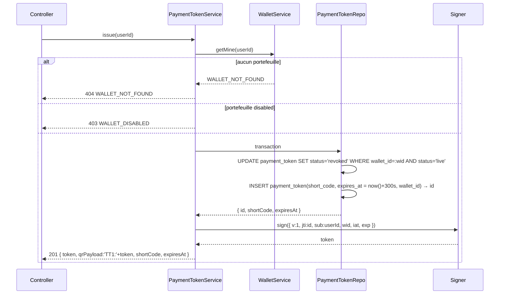
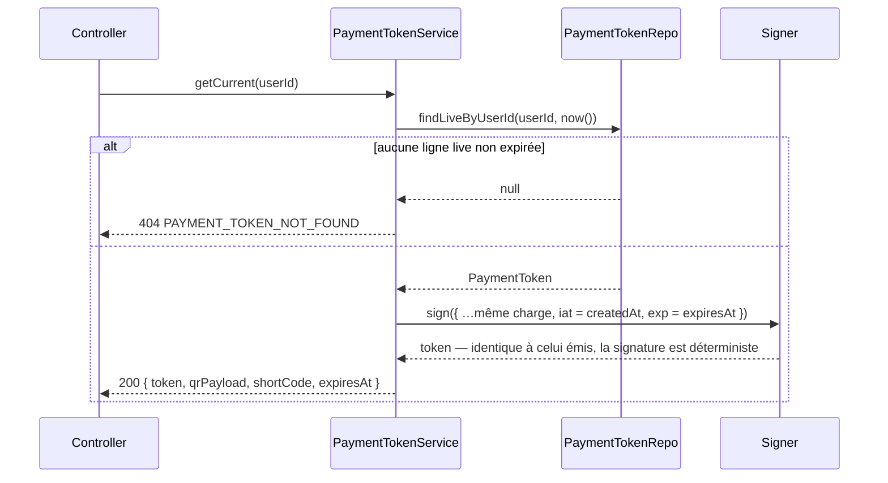
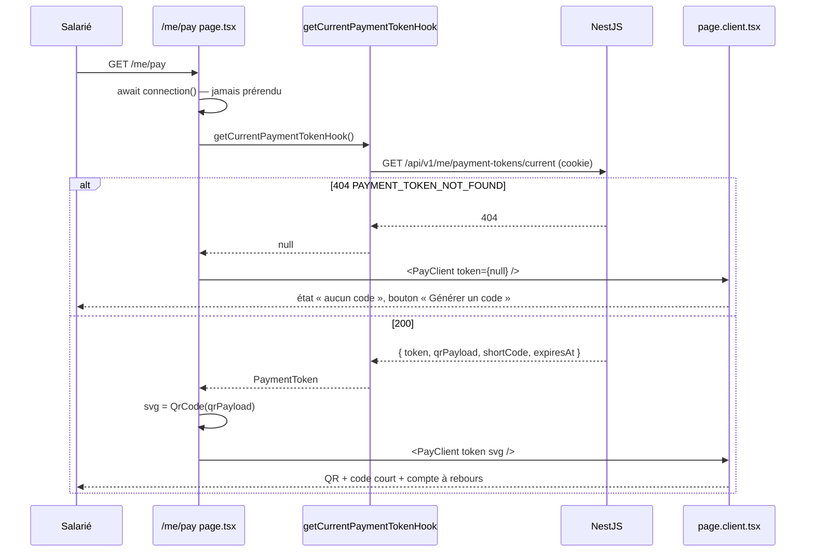
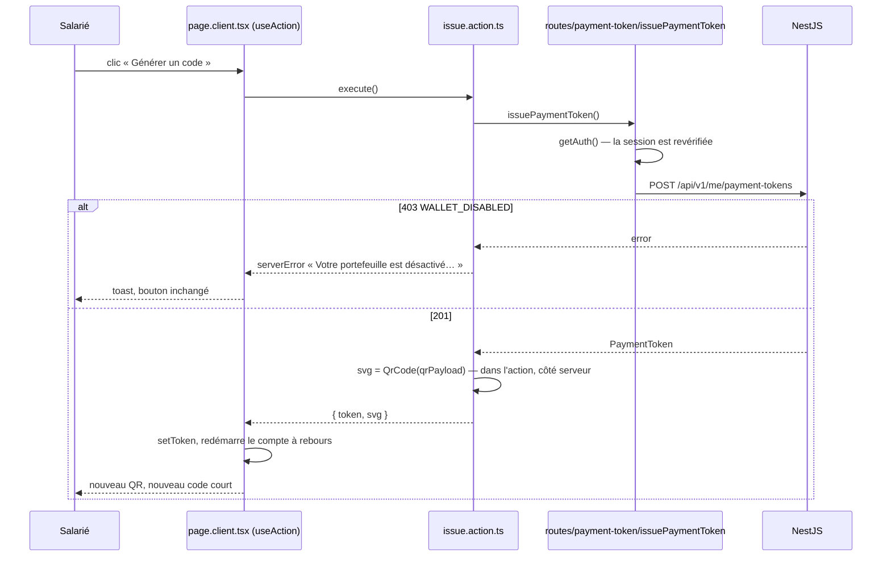

# Jeton de paiement et QR code — spécification frontend et backend

> **Sources** — cahier des charges `JEB/DNI/2026-002` §2.2 (QR à usage unique ou validité
> ≤ 5 min, fonctionnant en mode dégradé) et §3.2 (transactions non modifiables) ; PR #36
> (`apps/backend/src/modules/payments/payment-token/**`, mergée le 2026-09-04) ; entité
> `PaymentToken` (`modules/payments/core/entities/payment-token.entity.ts`) ;
> `docs/design/frontend.md` §3.5, §3.6, §6.8, `O1`, `O2` ;
> `docs/design/frontend-architecture.md` (A1–A12, PR #46) ; maquette
> `Web app design with Next.js/src/App.tsx`, vue `employee-pay` (l. 614–715).
>
> **Portée** — la génération du jeton côté API, son affichage côté salarié (`/me/pay`),
> et le format que la validation partenaire consommera. Spécification d'un lot à venir,
> écrite avant son code.
>
> **Hors portée** — l'encaissement côté partenaire (`/pro/collect`, lot `F-H`), le mode
> dégradé partenaire (`O2`), l'annulation administrative.

---

## 1. Le problème

Un salarié doit pouvoir présenter chez un partenaire un code que le partenaire scanne ou
saisit, valable quelques minutes et une seule fois, y compris si le téléphone du salarié
n'a plus de réseau au moment de payer.

La PR #36 a posé le contrat HTTP : `POST /api/v1/me/payment-tokens` et
`GET /api/v1/me/payment-tokens/current`, réponse `{ token, qrPayload, shortCode, expiresAt }`.
Mais derrière, `StaticPaymentTokenService` renvoie la même constante à tout le monde
(`token: 'demo-payment-token'`, `shortCode: 'CPR4F7X2'`, `expiresAt: '2026-09-04T02:02:00Z'`),
n'écrit rien dans `payment_token`, ne signe rien, et son `expiresAt` est déjà passé : un écran
branché dessus s'ouvre sur « expiré ». Côté frontend, `/me/pay` n'existe pas ; l'entrée
« Payer » et le bouton « Générer un code » ont été retirés dans #46 faute de route utilisable.

Ce lot remplace la constante par un vrai jeton et livre l'écran qui l'affiche.

---

## 2. Décisions verrouillées

| #       | Décision                                                                                                                                                                                                                        | Pourquoi                                                                                                                                                                                           |
| ------- | ------------------------------------------------------------------------------------------------------------------------------------------------------------------------------------------------------------------------------- | -------------------------------------------------------------------------------------------------------------------------------------------------------------------------------------------------- |
| **P1**  | Le jeton est **autoporteur et signé** : un JWS compact HS256 (`base64url(header).base64url(payload).base64url(signature)`) dont la charge porte `jti`, `sub`, `wid`, `iat`, `exp`, `v`.                                         | §2.2 : le partenaire doit pouvoir vérifier hors ligne qu'un code est authentique et non expiré. Un identifiant résolu en base ne le permet pas.                                                    |
| **P2**  | `jti` **est** l'`id` de la ligne `payment_token` (UUID v7). Rien d'autre n'est stocké du jeton : la signature prouve l'origine, la ligne porte l'état (`live` / `consumed` / `revoked`).                                        | Une seule clé pour l'usage unique et la corrélation ; aucune colonne à ajouter.                                                                                                                    |
| **P3**  | La signature vient de `crypto.createHmac('sha256', PAYMENT_TOKEN_SECRET)` (Node), **aucune nouvelle dépendance**. `PAYMENT_TOKEN_SECRET` est une variable d'environnement validée (≥ 32 caractères).                            | `jose` n'est pas déclaré dans `apps/backend/package.json` (il n'existe que comme dépendance transitive de Better Auth) ; un HMAC tient en trente lignes. Un secret est de l'infra, pas du métier.  |
| **P4**  | **TTL = `PAYMENT_TOKEN_TTL_SECONDS = 300`**, constante métier dans `payment-token.constants.ts`, valeur du cahier des charges. `O1` (30 min) se règle en changeant la constante, pas le mécanisme.                              | `fix-architecture-config-metier-constantes-pas-env` : un horizon produit est une constante revue, pas une variable d'env.                                                                          |
| **P5**  | **Un seul jeton vivant par portefeuille.** Émettre passe le précédent `live` à `revoked` dans la même transaction.                                                                                                              | Sinon un salarié accumule des codes valides ; `frontend.md` §6.8 : « générer remplace le précédent ».                                                                                              |
| **P6**  | Le **code court** fait 8 caractères sur l'alphabet `ABCDEFGHJKLMNPQRSTUVWXYZ23456789` (ni `I`, `O`, `0`, `1`), tiré au hasard cryptographique, unique parmi les jetons `live` (index partiel existant).                         | Équivalent textuel du QR, dicté ou saisi au clavier : aucune ambiguïté visuelle. 32⁸ ≈ 10¹² combinaisons pour quelques dizaines de codes vivants.                                                  |
| **P7**  | `qrPayload = 'TT1:' + token`. Le QR encode ce préfixe suivi du jeton ; `token` reste exposé nu dans la réponse.                                                                                                                 | Le scanner partenaire reconnaît un code du dispositif avant de le vérifier, et `v` dans la charge permet de changer de format sans casser les lecteurs.                                            |
| **P8**  | Le jeton n'est émis que pour un portefeuille **`active`** : `WALLET_NOT_FOUND` (404) sans portefeuille, `WALLET_DISABLED` (403) sinon. Le solde n'est **pas** vérifié à l'émission.                                             | `US-05-05` : « Payer » disparaît quand le portefeuille n'est pas actif. Le montant n'est connu qu'au moment de l'encaissement ; vérifier un solde ici figerait une information périmée dans le QR. |
| **P9**  | `GET /me/payment-tokens/current` renvoie le jeton `live` non expiré du portefeuille, ou `404 PAYMENT_TOKEN_NOT_FOUND`. Il **ne réémet jamais**.                                                                                 | La page `/me/pay` réaffiche le code en cours après un rechargement au lieu d'en brûler un nouveau ; l'émission reste un geste explicite.                                                           |
| **P10** | La charge du jeton ne contient **aucune donnée personnelle** : ni nom, ni courriel, ni solde. `sub` et `wid` sont des UUID.                                                                                                     | Le QR est montré à un tiers et peut être photographié.                                                                                                                                             |
| **P11** | Le QR est rendu **en SVG côté serveur** par la dépendance `qrcode` (`toString(payload, { type: 'svg', errorCorrectionLevel: 'M' })`), inline dans la page. Aucun appel réseau à l'affichage, aucun JavaScript pour le dessiner. | `US-07-07`. Le `QRCode` de la maquette est un motif décoratif, pas un encodeur. Une dépendance à ajouter explicitement dans `apps/frontend/package.json` — décision à confirmer (`Q3`).            |
| **P12** | `/me/pay` n'est **jamais** cachée ni prérendue : `connection()` avant toute lecture, comme `frontend.md` §3.5 le prévoit.                                                                                                       | Un jeton mis en cache est un jeton partagé.                                                                                                                                                        |

---

## 3. Le jeton

### 3.1 Charge utile

```json
{
  "v": 1,
  "jti": "01a06c9b-6f2e-7c31-8a11-3c8f0e2b9d44",
  "sub": "01a06c7a-f4fe-7883-bac8-b7e9153a40da",
  "wid": "01a06c9b-1d80-7f06-9b3c-0f2a7e51c8aa",
  "iat": 1788609600,
  "exp": 1788609900
}
```

| Champ | Contenu                           | Qui le lit                                               |
| ----- | --------------------------------- | -------------------------------------------------------- |
| `v`   | version du format, `1`            | le scanner, pour router vers le bon décodeur             |
| `jti` | `payment_token.id`                | la validation, pour l'usage unique (`live` → `consumed`) |
| `sub` | `user.id` du salarié              | la validation, pour la piste d'audit                     |
| `wid` | `wallet.id`                       | la validation, pour débiter le bon portefeuille          |
| `iat` | émission, secondes Unix           | diagnostic                                               |
| `exp` | `iat + PAYMENT_TOKEN_TTL_SECONDS` | le scanner hors ligne, puis la validation                |

En-tête JWS : `{ "alg": "HS256", "typ": "JWT" }`. Le format est un JWT standard pour qu'un
outil quelconque puisse le décoder ; la vérification, elle, ne fait confiance qu'à notre
propre code.

### 3.2 Réponse HTTP

Le DTO de #36 est conservé à l'identique :

```ts
{
  token: string;
  qrPayload: string;
  shortCode: string;
  expiresAt: string; /* ISO 8601 */
}
```

### 3.3 Ce que la validation partenaire fera de lui (lot suivant, pour mémoire)

1. Hors ligne : préfixe `TT1:`, signature, `exp` — refus immédiat si l'un des trois échoue.
2. En ligne : `payment_token.id = jti` est `live`, non expiré, `wallet_id = wid`, portefeuille
   actif, solde suffisant pour le montant saisi ; puis, dans une transaction, `status = consumed`,
   `consumed_at = now()`, création de `payment` et de la `wallet_entry` `debit / payment_sent`.
3. Un même `jti` présenté deux fois reçoit `PAYMENT_TOKEN_ALREADY_CONSUMED` ; un jeton `revoked`
   (remplacé par un plus récent) reçoit `PAYMENT_TOKEN_REVOKED`.

---

## 4. Backend

### 4.1 Fichiers

```
apps/backend/src/
├── config/env/env.schema.ts                       + PAYMENT_TOKEN_SECRET: z.string().min(32)
├── common/constants/error-codes.constant.ts       + WALLET_DISABLED, PAYMENT_TOKEN_NOT_FOUND
└── modules/payments/payment-token/
    ├── constants/payment-token.constants.ts       PAYMENT_TOKEN_TTL_SECONDS, SHORT_CODE_LENGTH, SHORT_CODE_ALPHABET, QR_PAYLOAD_PREFIX
    ├── controllers/payment-token.controller.ts    inchangé (POST /me/payment-tokens, GET /me/payment-tokens/current)
    ├── validators/payment-token.dto.ts            inchangé
    ├── repos/payment-token.repo.ts                NOUVEAU — seule couche ORM du module
    ├── services/
    │   ├── payment-token.service.ts               issue(), getCurrent() — remplace la délégation à PAYMENT_TOKEN_SOURCE
    │   └── helpers/
    │       ├── payment-token-signer.helper.ts     sign(payload) / verify(token) — crypto natif
    │       └── short-code.helper.ts               generateShortCode()
    ├── docs/commons/errors/                       + wallet-disabled.doc.ts, payment-token-not-found.doc.ts
    └── specs/                                     signer.spec.ts (unitaire), payment-token.integration.spec.ts
```

`StaticPaymentTokenService`, `payment-token.contract.ts` et le jeton `PAYMENT_TOKEN_SOURCE`
disparaissent : le contrat était un échafaudage pour la démo, le service réel n'a qu'une
implémentation. `PaymentTokenModule` importe `WalletsModule` pour le service exporté du
portefeuille (jamais son repo — `architecture-module-conventions`).

### 4.2 Schéma

**Aucune migration.** `payment_token` porte déjà `id`, `short_code char(8)`, `status`
(`live` / `consumed` / `revoked`), `expires_at`, `consumed_at`, `wallet_id`, et l'index unique
partiel `(short_code) WHERE status = 'live'`. Vérifié sur l'entité et sur la base locale.

### 4.3 Séquence — émission



Le `shortCode` est tiré dans la transaction ; une collision sur l'index partiel (improbable)
fait rejouer le tirage une fois, puis échoue en 500 plutôt que de boucler.

### 4.4 Séquence — lecture du jeton courant



Le jeton n'est pas stocké : il est **recomposé** depuis la ligne, à l'octet près, parce que
HMAC est déterministe et que `iat`/`exp` viennent des colonnes. C'est ce qui rend `P2`
possible sans colonne `token`.

### 4.5 Contrat d'erreurs

| Route                            | 401               | 403                                                   | 404                                           |
| -------------------------------- | ----------------- | ----------------------------------------------------- | --------------------------------------------- |
| `POST /me/payment-tokens`        | `UNAUTHENTICATED` | `FORBIDDEN_ROLE`, `ACCOUNT_BANNED`, `WALLET_DISABLED` | `WALLET_NOT_FOUND`                            |
| `GET /me/payment-tokens/current` | `UNAUTHENTICATED` | `FORBIDDEN_ROLE`, `ACCOUNT_BANNED`                    | `WALLET_NOT_FOUND`, `PAYMENT_TOKEN_NOT_FOUND` |

Un fichier Swagger par code (`docs/commons/errors/`), comme le module `wallets`.

### 4.6 Tests

| Niveau      | Ce qui est prouvé                                                                                                                                                                 |
| ----------- | --------------------------------------------------------------------------------------------------------------------------------------------------------------------------------- |
| Unitaire    | `sign` puis `verify` rend la charge ; un octet modifié dans la charge ou la signature est refusé ; `exp` passé est refusé ; deux `sign` de la même charge donnent la même chaîne. |
| Unitaire    | `generateShortCode` : 8 caractères, tous dans l'alphabet, jamais `I`/`O`/`0`/`1`.                                                                                                 |
| Intégration | `POST` crée une ligne `live`, `expiresAt ≈ now + 300 s`, `qrPayload` commence par `TT1:`, le `jti` décodé est l'`id` de la ligne.                                                 |
| Intégration | Deux `POST` successifs : la première ligne passe `revoked`, une seule `live` reste.                                                                                               |
| Intégration | `GET current` après `POST` renvoie **la même** chaîne `token` ; sans jeton → 404 ; jeton expiré (ligne insérée avec `expires_at` passé) → 404.                                    |
| Intégration | Portefeuille `disabled` → 403 `WALLET_DISABLED` ; sans portefeuille → 404 ; rôle `partner` → 403 `FORBIDDEN_ROLE` ; sans session → 401.                                           |
| Intégration | La charge décodée ne contient ni `email` ni `name` (P10).                                                                                                                         |

### 4.7 Limitation de débit

Le socle n'a pas de limiteur (décision du 2026-08-31, « à rouvrir quand les routes de
validation de QR existeront »). L'émission n'est pas la surface exposée : un salarié qui
spamme `POST` ne fait que révoquer ses propres codes. La surface à protéger est la
**validation** par code court (8 caractères devinables par force brute) — c'est le lot
`/pro/collect` qui rouvre la question, pas celui-ci.

---

## 5. Frontend

### 5.1 Fichiers

```
apps/frontend/
├── lib/api/
│   ├── clients/backend/endpoints/payment-token.ts   '@post/me/payment-tokens', '@get/me/payment-tokens/current'
│   ├── clients/backend/index.ts                     + WALLET_DISABLED, PAYMENT_TOKEN_NOT_FOUND dans ECODES
│   ├── schemas/backend/payment-token.ts             paymentTokenSchema { token, qrPayload, shortCode (8), expiresAt (ISO) }
│   └── routes/payment-token/                        issuePaymentToken.ts, getCurrentPaymentToken.ts, index.ts
├── hooks/api/proxy/payment-token.hook.ts            getCurrentPaymentTokenHook — optional, PAYMENT_TOKEN_NOT_FOUND → null
├── constants/api-errors.ts                          + deux messages
├── content/me.ts                                    + pay.*
├── components/composites/
│   ├── qr-code.tsx                                  <QrCode payload size> — SVG serveur via `qrcode`
│   ├── compte-a-rebours.client.tsx                  <CompteARebours expiresAt onExpired>
│   └── code-court.tsx                               <CodeCourt value> — 8 caractères espacés, copiable
└── app/(protected)/me/
    ├── @sidebar/page.tsx                            + entrée « Payer » (masquée si portefeuille non actif)
    ├── page.tsx                                     + bouton « Générer un code » (même condition), grille à deux colonnes
    └── pay/
        ├── page.tsx                                 connection(), lit le jeton courant, rend page.client
        ├── page.client.tsx                          état affiché/expiré, bouton (re)générer
        ├── actions/issue.action.ts                  issuePaymentTokenAction (actionClient)
        ├── loading.tsx  error.tsx
```

Tout suit `frontend-architecture.md` : la page n'importe que `hooks/api`, l'action passe
par `actionClient`, les libellés vivent dans `content/me.ts`.

### 5.2 Séquence — ouvrir `/me/pay`



Le QR est calculé côté serveur et descend en prop (`svg` en chaîne) : le client n'a rien à
dessiner, et un rechargement pendant la validité réaffiche **le même** code (P9).

### 5.3 Séquence — générer ou régénérer



L'action renvoie le SVG déjà rendu pour que le client n'embarque jamais l'encodeur.

### 5.4 L'écran

Reprise de la vue `employee-pay` de la maquette, avec les écarts suivants et rien d'autre :

| Maquette                                          | Ici                                                                                                       |
| ------------------------------------------------- | --------------------------------------------------------------------------------------------------------- |
| QR décoratif (motif aléatoire)                    | `<QrCode>` encode `qrPayload`                                                                             |
| Compte à rebours de 5 min démarré au montage      | `<CompteARebours expiresAt>` calcule depuis `expiresAt` : un rechargement ne remet pas le compteur à zéro |
| Code court `CPR4-F7X2`                            | `shortCode` du backend, affiché par groupes de quatre, bouton copier                                      |
| Voile « expiré » + « Générer un nouveau code »    | identique ; l'état expiré vient du compteur **et** d'un `PAYMENT_TOKEN_NOT_FOUND` au chargement           |
| Rappel du solde                                   | `<Montant>` depuis `getMyWalletHook` — même règle qu'ailleurs, mention « (simulation) » accolée           |
| Phrase « le montant est saisi par le partenaire » | conservée, dans `content/me.ts`                                                                           |

Accessibilité (`frontend.md` §6.8) : le compte à rebours est en `aria-live="polite"` et
n'annonce qu'à 60 s et à l'expiration ; le code court est l'équivalent textuel du QR
(`<svg role="img" aria-label="Code de paiement, équivalent textuel ci-dessous">`).

Hors ligne : une fois affiché, le QR reste scannable sans réseau — il est dans le DOM. Le
bouton « Générer » est désactivé quand `navigator.onLine` est faux, avec la phrase du bandeau
hors ligne ; c'est la seule chose que la perte de réseau empêche.

### 5.5 Ce qui revient sur `/me`

- L'entrée « Payer » dans `@sidebar` et la tuile « Générer un code » sur `/me`, retirées dans
  #46, reviennent ; la grille d'actions repasse à deux colonnes comme la maquette.
- Les deux sont **absentes** (pas désactivées) quand le portefeuille n'est pas `active` ou
  n'existe pas : le slot lit `getMyWalletHook()` (déjà mémoïsé, aucun appel en plus).

### 5.6 Cache

| Lecture             | Directive               | Pourquoi                                |
| ------------------- | ----------------------- | --------------------------------------- |
| Jeton courant       | aucune — `connection()` | P12 ; un jeton caché est partagé        |
| Solde rappelé       | aucune — `<Suspense>`   | D9 de `frontend.md`                     |
| Rien n'est invalidé | —                       | l'action ne touche aucune donnée cachée |

### 5.7 Tests

Le frontend n'a pas encore de lanceur de tests (`frontend.md` §9 prévoit Vitest). Ce lot
l'introduit si Vitest est accepté (`Q4`), avec trois tests : `<CompteARebours>` passe en
expiré à `expiresAt` et annonce à 60 s ; `<CodeCourt>` rend 8 caractères en deux groupes ;
`paymentTokenSchema` refuse un `shortCode` de 7 caractères et un `expiresAt` non ISO.

---

## 6. Découpage

Deux PR, dans cet ordre, sans dépendance de code entre elles :

| PR  | Branche                      | Contenu                                                              | Peut démarrer                             |
| --- | ---------------------------- | -------------------------------------------------------------------- | ----------------------------------------- |
| 1   | `feat/backend/payment-token` | §4 — signer, repo, service réel, codes d'erreur, env, Swagger, tests | maintenant, depuis `main`                 |
| 2   | `feat/frontend/pay`          | §5 — client, hook, action, `/me/pay`, retour de « Payer »            | après merge de #46 (elle étend `lib/api`) |

La PR 2 se développe contre le contrat de #36, qui ne change pas ; elle peut donc avancer en
parallèle de la PR 1 pourvu que `StaticPaymentTokenService` calcule `expiresAt = now + 300 s`
au lieu d'une date passée — un correctif d'une ligne, à faire en premier ou dans la PR 1.

---

## 7. Décisions ouvertes

| #      | Question                                                                                                  | Ce qui bloque                                                                                                                        | Qui tranche       |
| ------ | --------------------------------------------------------------------------------------------------------- | ------------------------------------------------------------------------------------------------------------------------------------ | ----------------- |
| **Q1** | TTL 5 min (P4, cahier des charges) ou 30 min (demande du Ministre, `O1` de `frontend.md`) ?               | Une constante ; mais 30 min affaiblit « usage unique et court »                                                                      | Équipe + Ministre |
| **Q2** | HMAC symétrique (P3) ou signature asymétrique (Ed25519) pour qu'un scanner tiers vérifie sans le secret ? | Le seul vérificateur prévu est notre backend ; l'asymétrique compte si un SIRH ou une app partenaire tierce doit vérifier hors ligne | Équipe            |
| **Q3** | Dépendance `qrcode` côté frontend (P11) — ou un encodeur maison ?                                         | Une dépendance de plus dans `apps/frontend/package.json`                                                                             | Nolan             |
| **Q4** | Introduire Vitest dans `apps/frontend` avec ce lot ?                                                      | Aucun test frontend n'existe ; `frontend.md` §9 le prévoit                                                                           | Nolan             |
| **Q5** | Faut-il un `GET current` du tout, ou `POST` idempotent qui renvoie le jeton vivant s'il existe ?          | #36 a posé deux routes ; les fusionner casse le contrat livré                                                                        | Équipe            |

---

## 8. Sources

- `apps/backend/src/modules/payments/payment-token/**` sur `main` (#36) : controller, DTO,
  `payment-token.contract.ts`, `constants/payment-token.constants.ts`, `StaticPaymentTokenService`.
- `apps/backend/src/modules/payments/core/entities/payment-token.entity.ts` — colonnes, enum
  `PaymentTokenStatus`, index unique partiel sur `short_code`.
- `apps/backend/src/config/env/env.schema.ts` — forme des variables validées.
- `docs/design/frontend.md` §3.5 (jeton : `connection()`), §3.6 (`createPaymentToken`), §6.8
  (`/me/pay`), §8 emplacement 3 de la mention de simulation, `O1`, `O2`.
- `docs/design/frontend-architecture.md` — A1–A12, §4 (client, routes, hooks, actions).
- Maquette `Web app design with Next.js/src/App.tsx` l. 567–715 (`QRCode`, `EmployeePay`).
- RFC 7515 (JWS), RFC 7519 (JWT) — format compact, champs `jti`, `sub`, `iat`, `exp`.
- `qrcode` (npm) — `toString(text, { type: 'svg' })`.
