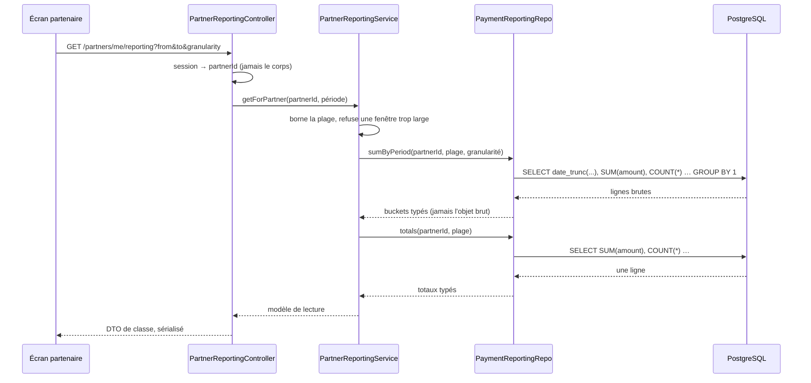
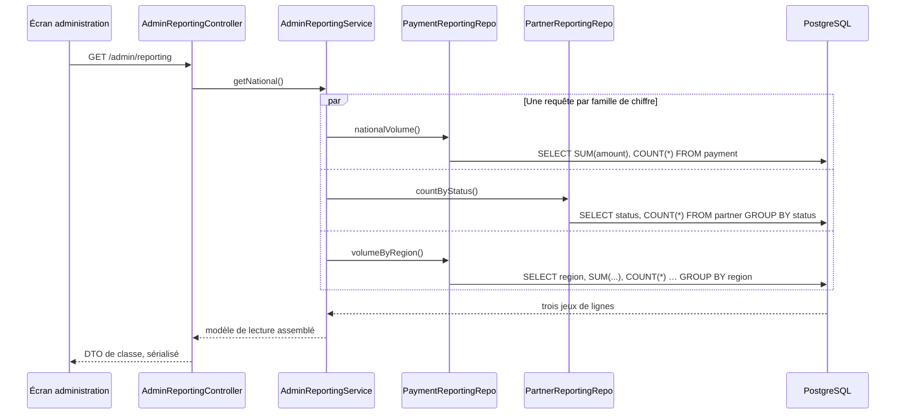

# Agrégation des données — tableaux de bord partenaire et national

> **Source** : cahier des charges `JEB/DNI/2026-002` §2.1 (espaces partenaire et
> administration) et §3.4 ; courrier de Florine Pontaillac du 1er septembre
> (emplacements de la mention de simulation) ; courrier de Thomas Vignal du
> 1er septembre (immuabilité, tests de charge).
> **Portée** : la couche de lecture agrégée du backend. Les écrans qui la
> consomment ne sont pas décrits ici.
> **État du dépôt** : relevé sur `main` au 10 septembre 2026.

## 1. Le problème

Le cahier des charges demande deux tableaux de bord, et aucun n'a de backend :

| Écran                      | Ce qu'il affiche                                                     | §    |
| -------------------------- | -------------------------------------------------------------------- | ---- |
| Tableau de bord partenaire | Montants reçus, transactions par période                             | §2.1 |
| Tableau de bord national   | Volume de transactions, partenaires actifs, répartition géographique | §2.1 |

Mesuré sur `main` : aucune route d'agrégation n'existe. Un écran qui voudrait
ces chiffres aujourd'hui devrait télécharger les écritures et les additionner
côté client — ce qui, sur le jeu de recette, veut dire descendre 200 lignes pour
en afficher trois, et grandir avec l'usage.

Ces deux écrans figurent aussi dans la liste des **neuf emplacements** où la
mention de simulation doit apparaître. Leur absence n'est donc pas seulement un
trou fonctionnel : c'est une preuve que le service juridique attend et qu'on ne
peut pas produire.

## 2. Ce sur quoi on agrège

Trois tables, toutes immuables (triggers `TRG_*_immutable`) :

| Table          | Ce qu'elle porte                                    | Index utiles                                       |
| -------------- | --------------------------------------------------- | -------------------------------------------------- |
| `payment`      | Un encaissement validé, son partenaire, son montant | `IDX_payment_partner_id`, `IDX_payment_created_at` |
| `wallet_entry` | La contrepartie comptable, par portefeuille         | `IDX_wallet_entry_wallet_id`                       |
| `allocation`   | Les abondements employeurs                          | —                                                  |

L'immuabilité est ce qui rend l'agrégation à la volée défendable : **une somme
recalculée sur des lignes qui ne changent jamais ne peut pas diverger de la
somme d'hier**. Un total ne bouge que parce qu'une ligne s'ajoute.

## 3. Décisions verrouillées

| Réf.   | Décision                                                                                                                                                                                                                                                      |
| ------ | ------------------------------------------------------------------------------------------------------------------------------------------------------------------------------------------------------------------------------------------------------------- |
| **D1** | **Agrégation à la volée en SQL, pas de compteurs dénormalisés.** Voir §4.                                                                                                                                                                                     |
| **D2** | **Le calcul vit dans un `*.repo.ts`, jamais dans un service.** C'est la seule couche qui touche l'ORM. Le service compose et mappe.                                                                                                                           |
| **D3** | **QueryBuilder, jamais de SQL brut.** `select`/`addSelect` portent les fragments d'agrégat (`SUM`, `COUNT`, `date_trunc`), la structure reste au builder — c'est le pattern de `follow.repo.ts` chez Yuno.                                                    |
| **D4** | **Une ligne brute n'est jamais renvoyée telle quelle.** `getRawMany()` produit des objets littéraux, que `ClassSerializerInterceptor` ne filtre pas : un `@Exclude()` y est inopérant. Le repo mappe vers un type nommé, le controller vers un DTO de classe. |
| **D5** | **Les périodes sont découpées dans le fuseau de l'utilisateur, pas en UTC.** Voir §5.                                                                                                                                                                         |
| **D6** | **Le partenaire ne voit que ses propres chiffres**, résolus depuis sa session, jamais depuis un identifiant du corps ou de l'URL.                                                                                                                             |
| **D7** | **Aucune table nouvelle, aucune vue matérialisée.** Le seul DDL est un index composite, généré par `db:generate` depuis un décorateur d'entité.                                                                                                               |

## 4. Pourquoi pas des compteurs dénormalisés

Yuno maintient des compteurs sur `party` (`likes_count`, `saves_count`) par
delta atomique, avec une passe de réconciliation nocturne. C'est le bon choix
là-bas, et le mauvais ici. La différence tient en une ligne :

> **Un compteur dénormalisé se justifie par le rapport entre le nombre de
> lectures et le nombre d'écritures, pas par le fait qu'il y ait un total à
> afficher.**

Chez Yuno, `likes_count` est lu sur **chaque carte de chaque feed**, des milliers
de fois pour une écriture. Ici, le total d'un partenaire est lu **quand ce
partenaire ouvre son tableau de bord** — quelques fois par jour, pour un volume
d'écritures du même ordre.

Ce que coûterait un compteur dénormalisé, et qu'on n'a pas de raison de payer :

- une colonne de plus sur `partner`, donc une migration sur une table vivante ;
- une écriture de plus dans la transaction d'encaissement, qui est déjà la plus
  contrainte du système (verrou sur le jeton, verrou sur le portefeuille) ;
- une **dérive possible**, donc une réconciliation, donc un cron, donc un
  rapport de réconciliation à surveiller ;
- et une seconde source de vérité sur un chiffre d'argent — exactement ce que
  l'immuabilité des écritures existe pour éviter.

Une vue matérialisée pose le même problème sous un autre nom : elle a besoin
d'un `REFRESH`, donc d'un ordonnanceur, et elle est fausse entre deux passes.

**Le jour où la mesure dira le contraire**, la bascule est locale : les mêmes
méthodes de repo, alimentées autrement. C'est aussi pour ça que le calcul est
enfermé dans un repo (D2).

## 5. Le piège des périodes

« Transactions par période » suppose de découper le temps. Les colonnes sont en
`timestamptz`, donc en UTC. Un `date_trunc('day', created_at)` groupe donc sur
des journées **UTC** : à Paris, une vente de 23h30 le lundi tombe dans le mardi,
et un commerçant qui compare son écran à sa caisse trouve l'écran faux.

Le découpage se fait donc dans le fuseau d'affichage :

```sql
date_trunc('day', p.created_at AT TIME ZONE 'Europe/Paris')
```

Le fuseau est une **constante métier** (`REPORTING_TIME_ZONE`), dans
`<module>/constants/`, pas une variable d'environnement : il est identique sur
tous les déploiements et il doit passer en revue de code.

Deux corollaires :

- **les bornes d'une plage demandée** se convertissent de la même façon, sinon
  le premier et le dernier jour d'un mois sont amputés ;
- **une période sans transaction doit apparaître à zéro**, pas disparaître. Un
  graphe qui saute les jours vides ment sur la forme de la courbe. Le remplissage
  se fait avec `generate_series`, côté SQL, pas en JavaScript après coup — sinon
  la pagination et les totaux ne portent pas sur le même ensemble.

## 6. Les routes

### 6.1 Tableau de bord partenaire

```
GET /api/v1/partners/me/reporting?from=&to=&granularity=day|week|month
```

Réservée au rôle `partner`. Le partenaire est résolu depuis la session (D6).

```jsonc
{
  "totals": {
    "grossAmount": "1240.50",
    "transactionCount": 87,
    "averageAmount": "14.26",
  },
  "buckets": [
    { "period": "2026-09-01", "amount": "112.40", "transactionCount": 8 },
    { "period": "2026-09-02", "amount": "0.00", "transactionCount": 0 },
  ],
}
```



### 6.2 Tableau de bord national

```
GET /api/v1/admin/reporting
```

Réservée au rôle `admin`.

```jsonc
{
  "volume": { "grossAmount": "48210.00", "transactionCount": 3421 },
  "partners": { "active": 9, "pending": 2, "refused": 1 },
  "byRegion": [
    { "region": "Occitanie", "amount": "8120.00", "transactionCount": 540 },
  ],
}
```



**La répartition géographique n'a pas de colonne.** `partner` porte `city`,
`postal_code`, `latitude`, `longitude` — pas de région. Le seed en dérive une
pour son rapport, sans la persister. Voir `O2`.

## 7. Le coût, compté en fonction de N

`N` = nombre de paiements sur la plage, `B` = nombre de périodes rendues.

| Chemin                     | Requêtes SQL           | Ce qui les borne                             |
| -------------------------- | ---------------------- | -------------------------------------------- |
| Tableau de bord partenaire | **2**, quel que soit N | Une pour les totaux, une pour les périodes   |
| Tableau de bord national   | **3**, quel que soit N | Une par famille de chiffre, lancées ensemble |

Aucun `await` dans une boucle, aucune résolution par ligne : c'est la règle qui a
déjà coûté cher ailleurs (`fix-architecture-cout-dun-chemin-de-lecture-...`).

Un index composite `(partner_id, created_at)` sert la requête du partenaire ;
les deux index simples existants ne peuvent pas la couvrir seuls. Il est déclaré
sur l'entité et généré par `bun run db:generate`.

## 8. Ce que le service refuse

| Cas                             | Réponse                                 |
| ------------------------------- | --------------------------------------- |
| `from` postérieure à `to`       | `400 VALIDATION_FAILED`                 |
| Plage plus large que le maximum | `400 REPORTING_RANGE_TOO_WIDE`          |
| Granularité inconnue            | `400 VALIDATION_FAILED`                 |
| Aucune plage fournie            | Trente derniers jours, borne par défaut |
| Partenaire pas encore actif     | `403 PARTNER_NOT_ACTIVE`                |

La borne de plage n'est pas une politesse : sans elle, une requête sur dix ans
avec une granularité au jour produit 3 650 périodes et un `generate_series` à
l'avenant.

## 9. Fichiers

```
apps/backend/src/modules/reporting/
├── reporting.module.ts
├── constants/reporting.constants.ts        ← fuseau, bornes, granularités
├── controllers/partner-reporting.controller.ts
├── controllers/admin-reporting.controller.ts
├── docs/                                    ← un fichier par code d'erreur remontable
├── repos/payment-reporting.repo.ts          ← les agrégats sur payment
├── repos/partner-reporting.repo.ts          ← les comptes par statut
├── services/partner-reporting.service.ts
├── services/admin-reporting.service.ts
├── services/helpers/period.helper.ts        ← bornes, granularité, remplissage
└── validators/reporting.dto.ts
```

Un module dédié plutôt qu'un ajout à `payments` : le reporting **lit** trois
domaines et n'en possède aucun. Le mettre dans `payments` obligerait le module de
paiement à connaître les partenaires et les régions.

## 10. Décisions ouvertes

| Réf.   | Question                                                                                                                                                                                                                                                                                              |
| ------ | ----------------------------------------------------------------------------------------------------------------------------------------------------------------------------------------------------------------------------------------------------------------------------------------------------- |
| **O1** | **Que compte-t-on comme « montant reçu » ?** Le brut encaissé, ou net d'éventuels remboursements ? `WalletEntryKind` prévoit `REFUND_SENT` / `REFUND_RECEIVED`, mais aucun chemin ne les écrit aujourd'hui. Proposition : le brut, et un champ net quand les remboursements existeront.               |
| **O2** | **D'où vient la région ?** `partner` n'en a pas. Trois options : la dériver du code postal par une table de correspondance, ajouter une colonne alimentée à l'inscription, ou remplacer « par région » par « par ville » dans un premier temps.                                                       |
| **O3** | **Le partenaire voit-il ses refus ?** Un encaissement refusé pour solde insuffisant n'écrit aucun `payment` — il n'existe que dans le journal d'audit. L'afficher demanderait de lire `audit_log` depuis le reporting, ce qui mélange deux préoccupations. Proposition : non, pas dans cette version. |
| **O4** | **La granularité par défaut.** Jour sur trente jours fait trente points ; mois sur un an en fait douze. Proposition : jour, et le client choisit.                                                                                                                                                     |

## Sources

- Cahier des charges fonctionnel CartePro, `JEB/DNI/2026-002` v1.0, §2.1 et §3.4.
- Courrier de Florine Pontaillac, 1er septembre 2026 — les neuf emplacements de
  la mention de simulation, dont les deux tableaux de bord.
- Courrier de Thomas Vignal, 1er septembre 2026 — immuabilité des écritures
  validées, tests de charge attendus.
- `apps/backend/src/modules/payments/core/entities/payment.entity.ts` — index et
  contraintes existants.
- `apps/backend/database/migrations/1788507000000-MoneyTablesImmutability.ts` —
  les triggers qui rendent l'agrégation à la volée stable.
- Yuno, `src/modules/follow/repos/follow.repo.ts` — la forme d'un agrégat au
  QueryBuilder ; `src/modules/party/post/repos/party-counter.repo.ts` — le
  pattern de compteur dénormalisé, et ce qu'il coûte.
- PostgreSQL, `date_trunc` et `AT TIME ZONE` — le découpage par fuseau.
